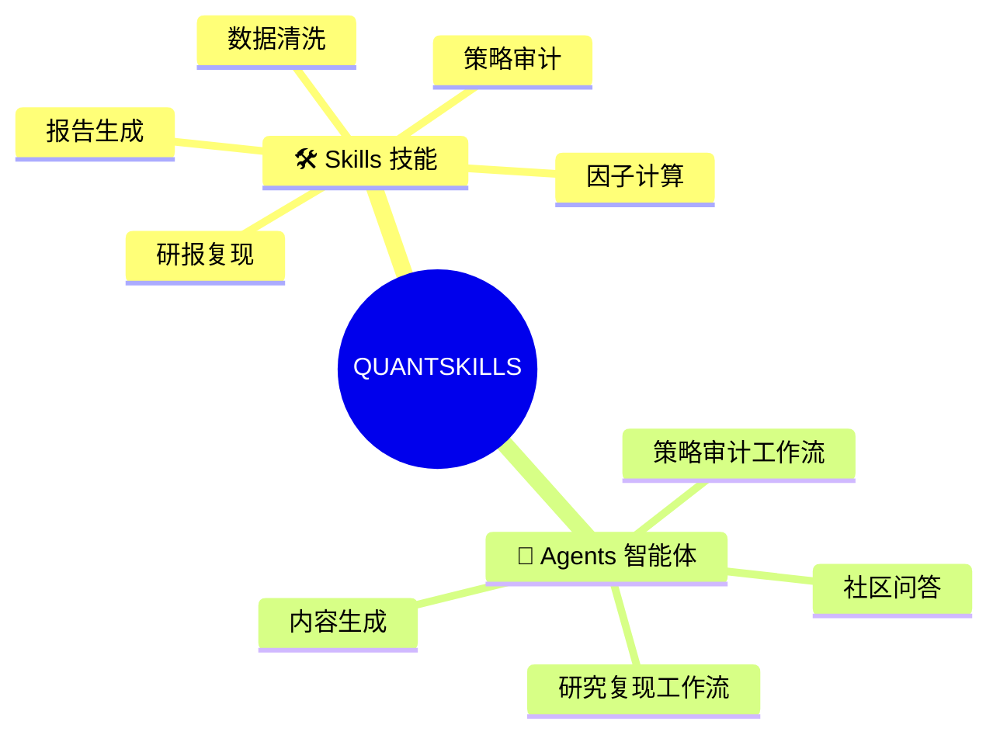
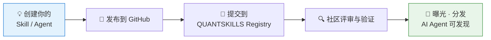
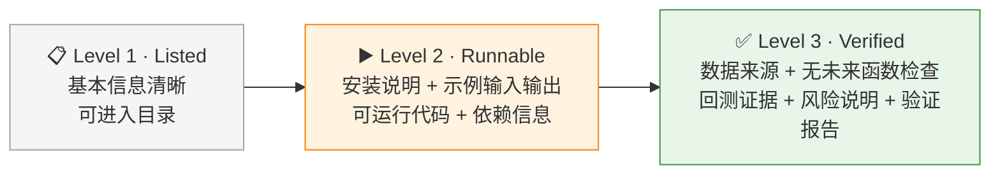
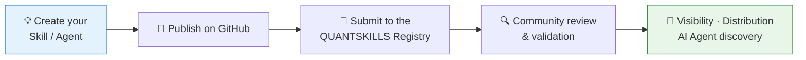
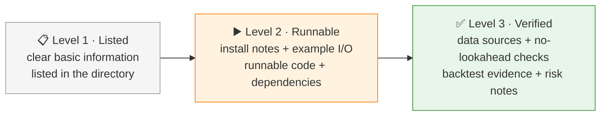

**简体中文** | [English](#english)

#  QUANTSKILLS

QUANTSKILLS 是 AI Agent 时代的开放量化社区，聚焦 **Quant Skills（量化技能）** 和 **Agents（智能体）** 两类资产。

QUANTSKILLS 由 PandaAI 发起，连接中文量化开发者与全球 AI 量化社区。PandaAI 在国内通过 [PandaAI Quant](https://www.pandaaiquant.com/) 服务本土用户，在国际通过 [TQX.ai](https://www.tqx.ai/) 面向全球开发者与研究者。

我们帮助量化开发者把交易经验、研究方法、因子模型和策略代码，转化为**可检索、可安装、可验证、可分享**的标准化资产。

> 把你的量化经验，变成人类可以信任、AI Agent 可以调用的 Skill。

## 🔗 官方入口

| 入口 | 链接 | 说明 |
|---|---|---|
| 🌐 官网 | https://quantskills.ai | 品牌叙事、Skill 发现、AI Agent 入口 |
| 🧭 资产导航 | [quantskills/quantskills](https://github.com/quantskills/quantskills) | Skill、因子、Agent 与组织资源的一站式可点击索引 |
| 📝 加入申请 | [提交 Join Request](https://github.com/quantskills/join/issues/new?template=join-request.yml) | 公开 Issue 表单申请加入 |
| 📜 社区规则 | [COMMUNITY_RULES.md](https://github.com/quantskills/join/blob/main/COMMUNITY_RULES.md) | 申请前请先阅读 |

## 🧩 我们收录什么

## 🗂️ 社区技能仓库一览

下表与 [registry/INDEX.md](https://github.com/quantskills/registry/blob/main/INDEX.md) 中的 Skill 资产目录保持同步。

| 仓库 | 一句话说明 |
|---|---|
| [skill-a1-lhb-tracking](https://github.com/quantskills/skill-a1-lhb-tracking) | A1 龙虎榜事件跟踪 Skill，基于公开行情与榜单数据整理营业部上榜、净买卖与事件排名结果。 |
| [skill-a-share-stock-dossier](https://github.com/quantskills/skill-a-share-stock-dossier) | 输入一个 A 股代码，输出一份可溯源的中文个股尽调报告：基本面、分红资本运作、股东行为、质押解禁减持风险、资金面，一次查清。 |
| [skill-futures-deepview-analyst](https://github.com/quantskills/skill-futures-deepview-analyst) | 把"分析螺纹钢席位博弈""看豆粕期限结构和仓单"这类自然语言请求，转成 Pandadata 期货 DeepView 数据调用计划，输出事实与推断分离的中文研判报告。 |
| [skill-gaetano-crux-capital-research-model](https://github.com/quantskills/skill-gaetano-crux-capital-research-model) | 基于公开资料复刻 Gaetano / Crux Capital 的研究方法：把公开 X 帖子、公开 Substack 页面、财报与技术论文，拆解成「光子堆栈定位 → chokepoint 识别 → 证据分级 → 催化与风险跟踪」的结构化研究模型。 |
| [skill-index-valuation-rotation](https://github.com/quantskills/skill-index-valuation-rotation) | 指数估值与行业轮动分析：PE/PB 分位、估值温度、宽基定投参考、行业动量排名与轮动摘要。 |
| [skill-options-vol-analyst](https://github.com/quantskills/skill-options-vol-analyst) | 期权波动率分析：期权链快照、隐含波动率、历史/实现波动率、IV 分位、期限结构、偏度与波动率溢价报告。 |

显示更多：剩余 80 个 Skill 仓库

| 仓库 | 一句话说明 |
|---|---|
| [skill-serenity-research-model](https://github.com/quantskills/skill-serenity-research-model) | 从 Serenity（@aleabitoreddit）的公开 X 帖子里逆向研究逻辑：extract → clean → auto-review → evaluate → report 五段流水线，把帖子拆成最小信号单元，并用价格数据回看公开 call 的后续表现。 |
| [skill-stock-screener](https://github.com/quantskills/skill-stock-screener) | 自然语言 A 股选股：把分红、估值、质押、北向、行业概念、财务增长、股东变化等条件转成可追溯 Pandadata 筛选。 |
| [skill-pandadata-api](https://github.com/quantskills/skill-pandadata-api) | 把自然语言数据需求，精准路由到正确的 pandadata API，并生成可直接运行的 Python 调用。 |
| [skill-pandadata-warehouse](https://github.com/quantskills/skill-pandadata-warehouse) | Pandadata 本地数据仓库：用 DuckDB 与 Parquet 缓存、增量刷新、查询和校验行情数据，减少重复 API 调用。 |
| [skill-quant-factor-directional-alpha](https://github.com/quantskills/skill-quant-factor-directional-alpha) | 方向类因子库：296 个独立 OHLCV 因子 Skill，真实行情验证 296/296 全部通过。 |
| [skill-quant-factor-risk-pattern-alpha](https://github.com/quantskills/skill-quant-factor-risk-pattern-alpha) | 风险状态与形态类因子库：288 个独立 OHLCV 因子 Skill，真实行情验证 288/288 全部通过。 |
| [skill-quant-factor-volume-stat-alpha](https://github.com/quantskills/skill-quant-factor-volume-stat-alpha) | 量能、量价和统计排序类因子库：216 个独立 OHLCV 因子 Skill，真实行情验证 216/216 全部通过。 |
| [skill-event-risk-alert](https://github.com/quantskills/skill-event-risk-alert) | A 股持仓和自选股事件风险预警：解禁、质押、减持、ST、业绩预告、审计意见等事件扫描与可追溯告警报告。 |
| [skill-factor-alpha191-alpha101](https://github.com/quantskills/skill-factor-alpha191-alpha101) | 参考 JoinQuant 公式批量计算 Alpha101 与 Alpha191 因子值，输出宽表 CSV 与跳过项摘要，供后续研究和验证使用。 |
| [skill-factor-blend](https://github.com/quantskills/skill-factor-blend) | 多因子信号合成 Skill：对已评估因子做去冗余、权重合成与复评估，输出组合信号与诊断报告。 |
| [skill-factor-decay](https://github.com/quantskills/skill-factor-decay) | 因子衰减分析 Skill：比较不同持有期的 IC、换手与分组收益衰减，用于判断信号寿命与再平衡频率。 |
| [skill-factor-orthogonalize](https://github.com/quantskills/skill-factor-orthogonalize) | 因子正交化 Skill：按日截面剥离行业、市值、风格和既有因子暴露，输出残差信号与暴露诊断。 |
| [skill-factor-optimize](https://github.com/quantskills/skill-factor-optimize) | 因子优化 Skill：对已有股票或期货因子做参数扫描、组件消融和核心版本增强，输出指标对比、稳健性讨论与是否替换原因子的结论。 |
| [skill-macro-monitor](https://github.com/quantskills/skill-macro-monitor) | 把“查 CPI”“本周有什么经济数据”“钢铁行业景气度怎么样”这类请求，路由到正确的 Pandadata getmacro 接口，输出带数据时效标注的中文宏观分析与定期监控。 |
| [skill-market-daily-review](https://github.com/quantskills/skill-market-daily-review) | 收盘后一句话生成 A 股当日复盘：指数与估值、市场宽度、行业概念热点、龙虎榜、大宗、两融、北向 —— 每个数字可溯源，支持定时自动生成。 |
| [skill-paper-replication](https://github.com/quantskills/skill-paper-replication) | 把一篇量化金融论文（arXiv 或本地 PDF），变成一套可运行、可审计的复现实验：检索 → 提取 → 回测 → 图表 → 指标对照，全程框架无关。 |
| [skill-doc-to-alphas](https://github.com/quantskills/skill-doc-to-alphas) | 从文档文本生成 OHLCV alpha 因子表达式，并提供公式契约与玩具数据自动验证。 |
| [skill-report-replication](https://github.com/quantskills/skill-report-replication) | 把一篇量化研报、论文、PDF、网页或文本材料，转化为完整的研究复现交付包：全文翻译 → 因子公式复现 → 有效性验证 → 策略代码 → 真实本地回测 → 交付摘要。 |
| [skill-backtest](https://github.com/quantskills/skill-backtest) | 不是回测框架，而是截面多头回测的标准协议：T+1 开盘成交、Top 等权、双边 15bp、涨跌停剔除、四联诊断图、5 项健康度自检。 |
| [skill-factor-debug](https://github.com/quantskills/skill-factor-debug) | 不是 IDE 调试器，而是因子崩溃 / 失效 / 数值异常的诊断手册：按"症状 → 候选病因 → 验证手段"组织的 9 类速查表，专治"因子跑挂"和"看似太好怀疑有 bug"。 |
| [skill-factor-evaluate](https://github.com/quantskills/skill-factor-evaluate) | 不是回测引擎，而是给单个因子打综合分的评价 Skill：双 IC + Sharpe + MDD + 单调性 + 换手 → 归一加权主分。 |
| [skill-factormad-debate-factor-mining](https://github.com/quantskills/skill-factormad-debate-factor-mining) | FactorMAD 多智能体辩论式因子挖掘 Skill，用公开假设、代码生成与验证循环探索股票 alpha 因子。 |
| [skill-factor-mine](https://github.com/quantskills/skill-factor-mine) | 不是因子库，而是因子挖掘的工作流 SOP：把"加一个新因子"这件事拆成可重复、可归因、可回滚的标准动作。 |
| [skill-factor-review](https://github.com/quantskills/skill-factor-review) | 不是单因子评价，而是因子库整体复盘 Skill：扫描实验日志 + 因子卡，输出三层报告（量化盘点 + 结构分析 + 研究建议），回答"已经做了什么、最优在哪、下一步该挖什么"。 |
| [skill-ic-analysis](https://github.com/quantskills/skill-ic-analysis) | 不是评分系统，而是IC 多维诊断 Skill：双 IC 对照 + IC 衰减曲线 + 子样本切片 + Top 篮 Jaccard + 时序累计图。回答"在哪类股票/什么周期上有效"。 |
| [skill-quant-factor-skill-factory](https://github.com/quantskills/skill-quant-factor-skill-factory) | 不是因子库本身，而是继续生产因子库的工具：批量生成、验证和打包框架中立的 OHLCV 量化因子 Skill。 |
| [skill-ssquant-ai-trader](https://github.com/quantskills/skill-ssquant-ai-trader) | 你负责说话，AI 负责写代码、跑策略、盯盘、控风险。 |
| [skill-ssquant-trader-generator](https://github.com/quantskills/skill-ssquant-trader-generator) | 说一次想法，得到一个可以随时加载的 AI 交易员。 |
| [skill-template](https://github.com/quantskills/skill-template) | QUANTSKILLS 的 skill-* 模板仓库，用于初始化带 SKILL.md、README、许可与基础适配文件的技能项目。 |
| [skill-time-series-analysis](https://github.com/quantskills/skill-time-series-analysis) | 面向时间序列分析任务的 Skill，聚焦时间序列特征检查、统计诊断与研究流程组织。 |
| [skill-xingtai-catcher](https://github.com/quantskills/skill-xingtai-catcher) | 用文字描述、K 线截图或手绘走势，在 A 股和期货里查找相似形态，并返回候选标的、评分与结果页。 |
| [skill-x-trader-builder](https://github.com/quantskills/skill-x-trader-builder) | 把任意 X/Twitter 公开交易员的发帖历史，加工成 trader 专属的研究模型 Skill：init-run → 采集 → extract → auto-review → split → evaluate → template → report 九步流水线，从噪... |
| [skill-alpha-a06-hotmoney-reversal](https://github.com/quantskills/skill-alpha-a06-hotmoney-reversal) | QuantSkills 社区项目；请维护者补充准确、克制的一句话说明。 |
| [skill-build-b10-factor-evaluation](https://github.com/quantskills/skill-build-b10-factor-evaluation) | QuantSkills 社区项目；请维护者补充准确、克制的一句话说明。 |
| [skill-quant-research-replication](https://github.com/quantskills/skill-quant-research-replication) | QuantSkills 社区项目；请维护者补充准确、克制的一句话说明。 |
| [skill-backtest-overfit](https://github.com/quantskills/skill-backtest-overfit) | Detect backtest overfitting and selection bias from multiple testing. Use when a user has a backtest / factor result and asks whether the Sharpe is real,... |
| [skill-earnings-season-tracker](https://github.com/quantskills/skill-earnings-season-tracker) | 按财报季时间窗对全市场做业绩横截面扫描：预告类型分布、超预期/暴雷榜、行业业绩景气、年报季审计非标清单 —— 每个数据点可溯源，支持财报季定时运行。 |
| [skill-portfolio-checkup](https://github.com/quantskills/skill-portfolio-checkup) | 输入一个持仓组合清单（代码+权重/市值），输出组合层级的体检报告：结构与集中度、估值与财务质量分布、风险敞口聚合（解禁/质押/减持/ST）、基准偏离与资金面。 |
| [skill-portfolio-optimize](https://github.com/quantskills/skill-portfolio-optimize) | Turn an alpha signal into optimal portfolio weights under real constraints. Use when a user has factor scores / expected returns and wants portfolio weights,... |
| [skill-risk-model](https://github.com/quantskills/skill-risk-model) | Build a Barra-style structural multi-factor risk model and attribute portfolio risk. |
| [skill-smart-money-profiler](https://github.com/quantskills/skill-smart-money-profiler) | 追踪"谁在买卖"以及"他们一贯怎么做"：龙虎榜席位身份识别与画像档案、北向资金跨期行为、北向×机构×融资×大宗的多源资金合力与分歧，输出可溯源的资金主体行为画像报告。 |
| [skill-factor-backtest](https://github.com/quantskills/skill-factor-backtest) | QuantSkills 社区项目；请维护者补充准确、克制的一句话说明。 |
| [skill-block-trade-radar](https://github.com/quantskills/skill-block-trade-radar) | A-share block-trade discount/premium radar skill |
| [skill-hk-us-insider-radar](https://github.com/quantskills/skill-hk-us-insider-radar) | HK/US insider trading signal radar skill |
| [skill-gao-shanwen-research-model](https://github.com/quantskills/skill-gao-shanwen-research-model) | Codex skill for Gao Shanwen bibliography and public article research workflow |
| [skill-model-hpo-evidence-driven](https://github.com/quantskills/skill-model-hpo-evidence-driven) | 面向量化多因子模型的 evidence-driven 超参数优化 Skill，通过固定训练验证流程、记录 trial 级别实验证据，并引入 LLM 对搜索空间进行自适应调整，用于提升 LGBM、MLP 等模型超参数搜索的系统性、可解释性和可复现性。 |
| [skill-fundamental-factor-analysis](https://github.com/quantskills/skill-fundamental-factor-analysis) | 计算、验证和分析A股基本面因子。覆盖估值(EP/BP/SP/CP/FCFP/GP/A)、质量(ROE/ROA/毛利率/应计利润/杠杆)、成长(盈利增长/营收增长/分析师预期调整)和复合因子。使用Pandadata财务API获取数据，通过IC分析、分组收益、Fama-MacBeth回归进行因子验证 |
| [skill-jq-to-panda-converter](https://github.com/quantskills/skill-jq-to-panda-converter) | 将聚宽(JoinQuant)平台策略代码批量转换为PandaAI平台支持的策略代码，理解策略思想而非逐行翻译，支持单文件转换和批量目录转换 |
| [skill-numerical-leak-check](https://github.com/quantskills/skill-numerical-leak-check) | 当 agent 需要检查时间序列计算、量化因子、特征工程、标签生成、回测信号或研究管线是否存在未来信息泄露时使用。Use this skill for numerical causality checks, lookahead/future-leakage detection, prefix replay,... |
| [skill-factor-pool-evolution](https://github.com/quantskills/skill-factor-pool-evolution) | One-round CogAlpha-style factor-pool recommendation workflow that prepares mutation and crossover prompt packs for the current model, then evaluates generated candidate factors by RankIC and RankICIR to recommend next-round seeds. |
| [skill-market-regime-analysis](https://github.com/quantskills/skill-market-regime-analysis) | 结合指数数据、宏观指标、期货期限结构和波动率聚集特征，对 A 股市场进行状态划分与状态感知的策略构建。 |
| [skill-fin-news](https://github.com/quantskills/skill-fin-news) | 实时财经资讯聚合 + AI 深度撰稿工具。 |
| [skill-global-commodity-term-structure](https://github.com/quantskills/skill-global-commodity-term-structure) | Research overseas commodity futures term structure, roll yield, and cross-commodity spreads from public data. |
| [skill-global-macro-rates-fx-lab](https://github.com/quantskills/skill-global-macro-rates-fx-lab) | Study global rates, FX, and macro regime from public FRED/central-bank data and Pandadata international macro. |
| [skill-global-macro-trend-strategy](https://github.com/quantskills/skill-global-macro-trend-strategy) | Turn an overseas commodity/macro/FX signal into a framework-neutral, backtestable research strategy. |
| [skill-overseas-equity-factor-miner](https://github.com/quantskills/skill-overseas-equity-factor-miner) | Discover and validate cross-sectional alpha factors for HK/US equities by IC, decay, and turnover. |
| [skill-pandaai-workflow-audit](https://github.com/quantskills/skill-pandaai-workflow-audit) | 像代码评审一样审计 PandaAI 工作流文件：图结构、策略与因子代码、数据时序、参数自由度、回测假设与验证证据，逐条给出缺陷与优化方案 |
| [skill-pandaai-workflow-generator](https://github.com/quantskills/skill-pandaai-workflow-generator) | 根据自然语言量化想法生成可一键导入 PandaAI 的工作流 JSON：LiteGraph 节点连线、内嵌 Python 策略/因子代码、成本与回测参数注入 |
| [skill-qbti](https://github.com/quantskills/skill-qbti) | QBTI（平凡人策略）：五组问答把投资性格翻译成因子方向与策略参数，交给 QuantSkills 因子库与回测流水线 |
| [skill-us-sec-edgar-harvester](https://github.com/quantskills/skill-us-sec-edgar-harvester) | Harvest and structure US SEC EDGAR public filings into a deduplicated, sourced, time-lined dataset. |
| [skill-stock-memory-analyzer-usa](https://github.com/quantskills/skill-stock-memory-analyzer-usa) | Multi-dimensional deep analysis platform for US semiconductor memory stocks. 美股存储芯片多维度深度分析 |
| [skill-alpha-f1-position-change](https://github.com/quantskills/skill-alpha-f1-position-change) | 当需要开发、计算、验证期货前20席位持仓突变因子时，使用此 skill。支持多空持仓优势分析、主力调仓方向判断。 |
| [skill-alpha-f5-member-position-concentration](https://github.com/quantskills/skill-alpha-f5-member-position-concentration) | Use when researching or validating the F5 commodity futures member-position concentration factor in a local Panda data environment. |
| [skill-alpha-f6-family-position-reverse](https://github.com/quantskills/skill-alpha-f6-family-position-reverse) | Use when researching or validating the F6 commodity futures family-position reverse factor in a local Panda data environment. |
| [skill-alpha-f8-family-main-divergence](https://github.com/quantskills/skill-alpha-f8-family-main-divergence) | Use when researching or validating the F8 commodity futures broker-position divergence factor in a local Panda data environment. |
| [skill-alpha-ncav-graham](https://github.com/quantskills/skill-alpha-ncav-graham) | Graham NCAV 净流动资产折价因子技能。A股深度价值筛选，排除金融股，计算 NCAV 折价并生成 buy/sell/hold 信号。 |
| [skill-b11-auto-stop-loss-take-profit](https://github.com/quantskills/skill-b11-auto-stop-loss-take-profit) | 当需要对 A 股和期货持仓做自动止盈止损与仓位管理时，使用此 skill。支持次日高开止盈、次日低开止损、持仓满2交易日强平、单票名义仓位上限控制。交易日历唯一来源 = panda_data.get_trade_cal（硬依赖）。 |
| [skill-b12-intraday-position-manager](https://github.com/quantskills/skill-b12-intraday-position-manager) | 当需要对日内多品种持仓做动态仓位管理时，使用此 skill。支持 A股/A股ETF/股指期货/商品期货/港股+ETF；区分 T+1/T+0、昨仓/今仓、保证金/现金，输出标准 8 字段调仓指令。 |
| [skill-b6-limitup-pool](https://github.com/quantskills/skill-b6-limitup-pool) | 涨停池动态管理 — panda-data BUILD 技能(B6)。每日维护涨停池，标记首板/连板数/炸板次数/回封时间，含题材分组/特殊形态/情绪面量化(分层晋级率·赚钱效应)，输出多维表格+HTML看板。 |
| [skill-b7-lhb-monitor](https://github.com/quantskills/skill-b7-lhb-monitor) | 龙虎榜监控+席位标签库 — panda-data BUILD 技能(B7)。收盘后抓取龙虎榜，席位标签匹配(北向/机构/游资/量化)，生成次日关注清单；个股详情页按上榜原因拆买卖营业部，支持区间统计与交互式HTML看板(搜索/筛选/排序/展开详情)。 |
| [skill-dalio-all-weather](https://github.com/quantskills/skill-dalio-all-weather) | Build and audit reproducible, research-only A-share All Weather allocations with PandaData, growth-inflation regimes, inverse-volatility risk budgets,... |
| [skill-factor-idea-generation](https://github.com/quantskills/skill-factor-idea-generation) | Generate initial stock alpha ideas with economic rationale and concrete factor shapes, defaulting to daily OHLCV when no fields are specified. |
| [skill-factor-ranking-sage](https://github.com/quantskills/skill-factor-ranking-sage) | Rank and select quantitative model factors from local factor and label CSV files with one of two self-contained methods: deterministic regression mRMR using... |
| [skill-hk-stock-dossier](https://github.com/quantskills/skill-hk-stock-dossier) | 生成结构化港股尽职调查研报，输出为中文 Markdown 研报。 |
| [skill-investment-decision](https://github.com/quantskills/skill-investment-decision) | 输入公司名称或股票代码，基于Yahoo Finance公开数据与网络搜索，输出长期（6-18个月）投资决策报告（买入/中性/卖出+置信度）.docx，含图表与完整数据来源。 |
| [skill-munger-mental-model](https://github.com/quantskills/skill-munger-mental-model) | Munger 5-维模型与一票否决的多角度cross-validation分析工具，面向 A 股。支持单票和行业批筛。 |
| [skill-news-sentiment-analyst](https://github.com/quantskills/skill-news-sentiment-analyst) | A-share financial news sentiment analyst - Claude Code Skill |
| [skill-simons-pairs-trading](https://github.com/quantskills/skill-simons-pairs-trading) | Screen and audit reproducible, research-only A-share pairs with adjusted PandaData prices, same-industry Engle-Granger tests, Benjamini-Hochberg FDR,... |
| [skill-templeton-global-contrarian](https://github.com/quantskills/skill-templeton-global-contrarian) | John Templeton 逆向全球价值因子技能。A股/港股/美股跨市场价值筛选，基于估值偏离度识别极端低估/高估机会，生成 buy/sell/hold 信号。 |
| [skill-residual-guided-factor-selection](https://github.com/quantskills/skill-residual-guided-factor-selection) | 基于样本外残差IC和LightGBM增量重训练，筛选具有互补信息的候选因子 |

## 🤖 社区 Agent 仓库一览

下表与 [registry/INDEX.md](https://github.com/quantskills/registry/blob/main/INDEX.md) 中的 Agent 资产目录保持同步。

| 仓库 | 一句话说明 |
|---|---|
| [agent-correlation-break-research](https://github.com/quantskills/agent-correlation-break-research) | 用多股票与指数收益相关性变化识别风格切换、组合分散失效和结构性行情变化。 |
| [agent-derivatives-skew-sentiment-monitor](https://github.com/quantskills/agent-derivatives-skew-sentiment-monitor) | 用期权隐含波动率和标的历史波动率观察衍生品市场风险偏好，不重复已有期权波动率分析 Skill。 |
| [agent-market-regime-monitor](https://github.com/quantskills/agent-market-regime-monitor) | 用 Pandadata 行情、指数、宽度、波动和资金证据判断市场处于趋势、震荡、退潮或风险扩张状态。 |
| [agent-crowding-risk-monitor](https://github.com/quantskills/agent-crowding-risk-monitor) | 用价格、成交、融资、龙虎榜热度识别抱团、过热、踩踏和去杠杆风险。 |
| [agent-quantspace](https://github.com/quantskills/agent-quantspace) | 面向 AI 编码代理的量化研究框架，组织数据、技能、策略、回测和报告工作流。 |
| [agent-template](https://github.com/quantskills/agent-template) | QUANTSKILLS 的 agent-* 模板仓库，用于初始化带 AGENTS.md、README 与基础适配文件的 Agent 项目。 |
| [agent-for-liangshuyuan-tasks](https://github.com/quantskills/agent-for-liangshuyuan-tasks) | 量枢学院多 Agent 协作框架，支持任务需求分析、路由、开发、测试和发布流程自动化。 |
| [agent-ssquant](https://github.com/quantskills/agent-ssquant) | QuantSkills 社区项目；请维护者补充准确、克制的一句话说明。 |
| [agent-macro-driven-rotation](https://github.com/quantskills/agent-macro-driven-rotation) | 宏观驱动行业轮动 Agent |

## 🚀 如何参与

贡献者可以获得：

- **曝光**：进入 QUANTSKILLS 目录、官网页面、精选列表与社区推荐
- **可信度**：获得 QS-Compatible、PandaData-Compatible、Backtest-Reproducible 等验证标签
- **分发**：让 Skill 可被未来的 AI Agent 搜索、安装、调用
- **协作**：参与策略共创、内容项目、企业项目、验证服务与付费 Skill
- **个人品牌**：从"我写了一个策略"，升级为"我发布了一个被社区收录和评审的量化 Skill"

早期阶段我们不强制统一模板：研究笔记、Prompt、Python 脚本、Agent 工作流、策略代码、数据校验、文档都可以是 Skill。

> 我们不用模板限制创造力，用注册与验证建立秩序。

## 📛 仓库命名

QUANTSKILLS 组织下的仓库应使用小写的 `skill-` 或 `agent-` 前缀。

- `skill-`：可复用能力，如因子、策略模板、数据处理、研报复现、验证工具、Prompt、示例或工具。
- `agent-`：AI Agent 或自动化工作流，如研究复现 Agent、策略审计 Agent、数据处理 Agent、评审 Agent 或多步任务系统。

每个仓库的根目录应包含一个声明文件：

- Skill 仓库：`SKILL.md`
- Agent 仓库：`AGENTS.md`

声明文件或项目清单中应包含上游元数据，例如 QuantSkills 组织 URL、仓库名、仓库 URL、项目类型，以及（如适用）所属合集（collection）。

AI 辅助工具可以使用仓库名、`SKILL.md` / `AGENTS.md`、README 与描述信息来协助维护公共注册表。最终的收录、推荐、验证或官方认定，仍需经过维护者评审。

完整仓库规则见 [COMMUNITY_RULES.md](https://github.com/quantskills/join/blob/main/COMMUNITY_RULES.md)。

## 🎖️ 验证等级

| 等级 | 适用对象 |
|---|---|
| 📋 **Listed** | 研究方法、Prompt 型 Skill、早期想法、教学示例 |
| ▶️ **Runnable** | 因子计算、数据处理、报告生成、简单策略脚本 |
| ✅ **Verified** | 因子研究、策略研究、回测系统、可交易策略示例 |

> 低门槛加入，高标准验证。

## 🤖 面向 AI Agent 的发现机制

QUANTSKILLS 同时为人类和 AI Agent 设计。我们将逐步建设：

- `llms.txt`
- Skills 索引 / Agents 索引
- MCP 服务
- GitHub README、Topics 与 Release 约定

目标：让 AI Agent 能够从社区**搜索、安装、调用、验证**量化能力。

## 🌍 语言政策

公开仓库的元数据、标题、摘要和关键文档以英文为主，方便全球贡献者与 AI Agent 理解和索引；同时支持中文、日文、韩文、西班牙文、法文、德文等语言用于讨论、教程、示例、研究笔记和社区协作。

任何语言的贡献都欢迎，只需附上简短的英文标题、摘要或 README 小节。

## 📜 社区规则摘要

- 尊重贡献者，保持建设性讨论。
- 不提交垃圾信息、误导性项目、违法内容、不安全代码、泄露数据或侵权材料。
- 不在公开 Issue、PR、README 或仓库中发布敏感信息（手机号、微信号、邮箱、证件号、密码、API Key、账户凭证）。
- 成员创建的仓库默认为 **Community Project**，未经评审不得宣称官方、认证、已验证或背书状态。
- 量化项目应明确说明数据来源、假设、局限和风险边界。
- 维护者可在必要时进行内容管理、归档、限制、转移或删除。

完整规则见 [COMMUNITY_RULES.md](https://github.com/quantskills/join/blob/main/COMMUNITY_RULES.md)。

## 🏛️ 仓库治理

成员可在 QUANTSKILLS 组织下创建并维护自己的社区项目。`github.com/quantskills` 下的仓库由 QUANTSKILLS 组织托管和治理：

- 项目创建者保留作品的**署名、荣誉与贡献历史**，并可按授予的权限维护仓库；
- 组织所有者保留最终治理权，必要时（安全问题、法律风险、垃圾信息、废弃项目、命名冲突、违反规则）可重命名、归档、转移、限制访问或删除仓库；
- 成员创建的仓库默认为社区项目，不自动代表 QUANTSKILLS 官方验证或背书，后续可按社区规则评审标记为 Listed / Runnable / Verified。

## 🎯 长期目标

如果你有一个量化方法、因子、策略、工具或工作流，QUANTSKILLS 要帮你把它发布成：**人类看得见、AI Agent 找得到、社区可验证**的 Skill。

## 🐼 PandaAI 社群

  
   
  扫码加入 PandaAI 社群，交流 QUANTSKILLS 技能、Agent 工作流与量化研究实践。

---

#  QUANTSKILLS (English)

[简体中文](#chinese) | **English**

QUANTSKILLS is an open community for **Quant Skills and Agents** in the AI Agent era.

Initiated by PandaAI, QUANTSKILLS connects Chinese quant developers with the global AI quant community. PandaAI serves local users through [PandaAI Quant](https://www.pandaaiquant.com/) and international developers and researchers through [TQX.ai](https://www.tqx.ai/).

We help quant developers turn trading experience, research methods, factor models, and strategy code into standardized assets that can be **searched, installed, validated, and shared**.

> Turn your quant experience into Skills that humans can trust and AI Agents can use.

## 🔗 Official Links

| Entry | Link | Notes |
|---|---|---|
| 🌐 Website | https://quantskills.ai | Brand narrative, Skill discovery, AI Agent-facing entry points |
| 🧭 Asset navigator | [quantskills/quantskills](https://github.com/quantskills/quantskills) | One-stop clickable index for Skills, factors, Agents, and organization resources |
| 📝 Join request | [Open a Join Request](https://github.com/quantskills/join/issues/new?template=join-request.yml) | Public issue-form application |
| 📜 Community rules | [COMMUNITY_RULES.md](https://github.com/quantskills/join/blob/main/COMMUNITY_RULES.md) | Please read before applying |

## 🧩 What We Collect

QUANTSKILLS focuses on two types of assets:

- **Skills**: factor calculation, data cleaning, strategy audit, research report replication, report generation, and other reusable capability packages
- **Agents**: research replication, strategy audit, content generation, community Q&A, and other AI Agent workflows

## 🗂️ Community Skill Repositories

This table mirrors the Skill asset directory in [registry/INDEX.md](https://github.com/quantskills/registry/blob/main/INDEX.md).

| Repository | One-line summary |
|---|---|
| [skill-a1-lhb-tracking](https://github.com/quantskills/skill-a1-lhb-tracking) | A1 Longhubang event-tracking skill for ranking brokerage-seat activity, net buying and selling, and related market events from public data. |
| [skill-a-share-stock-dossier](https://github.com/quantskills/skill-a-share-stock-dossier) | A-share stock dossier skill that uses Pandadata to produce company, financial, dividend, shareholder, and risk analysis. |
| [skill-futures-deepview-analyst](https://github.com/quantskills/skill-futures-deepview-analyst) | Futures DeepView analyst skill for position seats, basis, inventory, term structure, and calendar-spread signals from Pandadata. |
| [skill-gaetano-crux-capital-research-model](https://github.com/quantskills/skill-gaetano-crux-capital-research-model) | Research-model skill for public-material analysis of photonics, optical networking, Physical AI, and AI infrastructure themes. |
| [skill-index-valuation-rotation](https://github.com/quantskills/skill-index-valuation-rotation) | Index valuation and A-share industry rotation skill for PE/PB percentiles, valuation temperature, broad-index references, momentum ranks, and rotation summaries. |
| [skill-options-vol-analyst](https://github.com/quantskills/skill-options-vol-analyst) | Options volatility analyst skill for option chains, implied volatility, realized volatility, IV percentiles, term structure, skew, and volatility-premium reports. |

Show more: remaining 80 Skill repositories

| Repository | One-line summary |
|---|---|
| [skill-serenity-research-model](https://github.com/quantskills/skill-serenity-research-model) | Research-model skill for reconstructing Serenity-style AI, semiconductor, and supply-chain theses from public posts and datasets. |
| [skill-stock-screener](https://github.com/quantskills/skill-stock-screener) | Natural-language A-share stock screener skill that maps fundamentals, dividends, valuation, pledges, northbound flows, sectors, holders, and risk filters to Pandadata calls. |
| [skill-pandadata-api](https://github.com/quantskills/skill-pandadata-api) | Pandadata and panda_data Python SDK reference skill for selecting, calling, and troubleshooting quant data APIs. |
| [skill-pandadata-warehouse](https://github.com/quantskills/skill-pandadata-warehouse) | Pandadata warehouse skill for caching, refreshing, querying, and validating local DuckDB and Parquet market-data stores. |
| [skill-quant-factor-directional-alpha](https://github.com/quantskills/skill-quant-factor-directional-alpha) | Directional OHLCV alpha factor library with 296 trend, breakout, reversal, and channel-position factor Skills validated on real market data. |
| [skill-quant-factor-risk-pattern-alpha](https://github.com/quantskills/skill-quant-factor-risk-pattern-alpha) | Risk-state and chart-pattern OHLCV alpha factor library with 288 factor Skills for volatility, K-line shape, shock, drawdown, and pressure analysis. |
| [skill-quant-factor-volume-stat-alpha](https://github.com/quantskills/skill-quant-factor-volume-stat-alpha) | Volume, volume-price, ranking, and statistical OHLCV alpha factor library with 216 factor Skills validated on real market data. |
| [skill-event-risk-alert](https://github.com/quantskills/skill-event-risk-alert) | A-share event-risk alert skill for watchlists, holdings, unlocks, pledges, reductions, ST changes, forecasts, audit opinions, and traceable reports. |
| [skill-factor-alpha191-alpha101](https://github.com/quantskills/skill-factor-alpha191-alpha101) | Factor-library skill for computing Alpha101 and Alpha191 values from long-form OHLCV CSV data, with wide CSV outputs and skipped-factor summaries for downstream research. |
| [skill-factor-blend](https://github.com/quantskills/skill-factor-blend) | Multi-factor blending skill for deduplicating evaluated signals, combining weights, and re-evaluating one composite signal with diagnostics. |
| [skill-factor-decay](https://github.com/quantskills/skill-factor-decay) | Factor-decay analysis skill for comparing IC, turnover, and group-return decay across holding horizons to judge signal shelf life. |
| [skill-factor-orthogonalize](https://github.com/quantskills/skill-factor-orthogonalize) | Factor-orthogonalization skill for stripping industry, size, style, and legacy-factor exposures from daily cross-sectional signals. |
| [skill-factor-optimize](https://github.com/quantskills/skill-factor-optimize) | Factor-optimization skill for sweeping parameters, running component ablations, and refining existing stock or futures factors with a keep-or-replace conclusion. |
| [skill-macro-monitor](https://github.com/quantskills/skill-macro-monitor) | Macro monitoring skill for Pandadata macro data, economic calendars, industry prosperity, and high-frequency signals. |
| [skill-market-daily-review](https://github.com/quantskills/skill-market-daily-review) | A-share end-of-day review skill covering indexes, valuation, breadth, sentiment, sectors, themes, and capital-flow clues. |
| [skill-paper-replication](https://github.com/quantskills/skill-paper-replication) | Framework-neutral quantitative paper replication skill for research scripts, backtests, charts, and auditable outputs. |
| [skill-doc-to-alphas](https://github.com/quantskills/skill-doc-to-alphas) | Generate OHLCV alpha expressions from document text, with a formula contract and toy-data validation. |
| [skill-report-replication](https://github.com/quantskills/skill-report-replication) | Quant report replication skill that turns papers or reports into Chinese translations, factor formulas, validation reports, and strategy assets. |
| [skill-backtest](https://github.com/quantskills/skill-backtest) | Standard cross-sectional long-only backtest protocol with T+1 execution, fees, limit filters, NAV curves, IC, drawdown, and diagnostic charts. |
| [skill-factor-debug](https://github.com/quantskills/skill-factor-debug) | Factor debugging playbook for NaNs, signal validation failures, look-ahead bias, horizon mismatch, checksum drift, and correlation violations. |
| [skill-factor-evaluate](https://github.com/quantskills/skill-factor-evaluate) | Single-factor evaluation skill covering rank IC, Pearson IC, Sharpe, drawdown, monotonicity, turnover, and composite scoring. |
| [skill-factormad-debate-factor-mining](https://github.com/quantskills/skill-factormad-debate-factor-mining) | FactorMAD multi-agent debate skill for exploring stock alpha factors through public hypotheses, code generation, and validation loops. |
| [skill-factor-mine](https://github.com/quantskills/skill-factor-mine) | Disciplined factor-mining workflow for hypothesis design, implementation, validation, iteration notes, acceptance, and rollback decisions. |
| [skill-factor-review](https://github.com/quantskills/skill-factor-review) | Factor-library review skill for experiment logs, acceptance rates, score dynamics, factor-family structure, correlations, and research recommendations. |
| [skill-ic-analysis](https://github.com/quantskills/skill-ic-analysis) | Multidimensional IC diagnostics for rank versus Pearson IC, IC decay, subsample IC, top-basket stability, and cumulative IC timelines. |
| [skill-quant-factor-skill-factory](https://github.com/quantskills/skill-quant-factor-skill-factory) | Factory skill for turning OHLCV alpha ideas into QuantSkills factor skills with real-market validation and packaging. |
| [skill-ssquant-ai-trader](https://github.com/quantskills/skill-ssquant-ai-trader) | SSQuant AI Trader skill for converting natural-language trading descriptions into automated or semi-automated strategy workflows. |
| [skill-ssquant-trader-generator](https://github.com/quantskills/skill-ssquant-trader-generator) | Trader-generator skill that turns natural-language trading ideas into deployable AI Trader rules, code, and operating plans. |
| [skill-template](https://github.com/quantskills/skill-template) | Template repository for initializing QuantSkills skill projects with SKILL.md, README files, licensing, and baseline adapters. |
| [skill-time-series-analysis](https://github.com/quantskills/skill-time-series-analysis) | Time-series analysis skill focused on feature inspection, statistical diagnostics, and research workflow organization. |
| [skill-xingtai-catcher](https://github.com/quantskills/skill-xingtai-catcher) | Pattern-search skill for finding similar A-share stock and futures K-line setups from text, screenshots, or hand drawings, with scored candidates and result links. |
| [skill-x-trader-builder](https://github.com/quantskills/skill-x-trader-builder) | Skill-builder workflow for turning public X/Twitter data and user materials into trader-specific research-model skills. |
| [skill-alpha-a06-hotmoney-reversal](https://github.com/quantskills/skill-alpha-a06-hotmoney-reversal) | QuantSkills community project; maintainers should add an accurate one-line summary. |
| [skill-build-b10-factor-evaluation](https://github.com/quantskills/skill-build-b10-factor-evaluation) | QuantSkills community project; maintainers should add an accurate one-line summary. |
| [skill-quant-research-replication](https://github.com/quantskills/skill-quant-research-replication) | QuantSkills community project; maintainers should add an accurate one-line summary. |
| [skill-backtest-overfit](https://github.com/quantskills/skill-backtest-overfit) | Detect backtest overfitting and selection bias from multiple testing. Use when a user has a backtest / factor result and asks whether the Sharpe is real, whether a strategy is overfit, or wants to validate results... |
| [skill-earnings-season-tracker](https://github.com/quantskills/skill-earnings-season-tracker) | Whole-market A-share earnings-season scanner covering forecast-type distribution, beat/miss leaders, industry earnings prosperity, and audit-opinion watchlists. |
| [skill-portfolio-checkup](https://github.com/quantskills/skill-portfolio-checkup) | Portfolio-level checkup skill that uses Pandadata to aggregate single-stock signals into portfolio structure, concentration, weighted valuation/quality, risk exposure, and benchmark deviation. |
| [skill-portfolio-optimize](https://github.com/quantskills/skill-portfolio-optimize) | Turn an alpha signal into optimal portfolio weights under real constraints. Use when a user has factor scores / expected returns and wants portfolio weights, or asks about mean-variance / risk-parity / minimum-variance... |
| [skill-risk-model](https://github.com/quantskills/skill-risk-model) | Build a Barra-style structural multi-factor risk model and attribute portfolio risk. Use when a user wants a covariance matrix for optimisation, asks how risky a portfolio is, where its risk comes from (which factors /... |
| [skill-smart-money-profiler](https://github.com/quantskills/skill-smart-money-profiler) | Identify the capital actors behind A-share trades and profile their cross-period behavior using Pandadata seat, northbound, margin, and block-trade data. |
| [skill-factor-backtest](https://github.com/quantskills/skill-factor-backtest) | QuantSkills community project; maintainers should add an accurate one-line summary. |
| [skill-block-trade-radar](https://github.com/quantskills/skill-block-trade-radar) | A-share block-trade discount/premium radar skill |
| [skill-hk-us-insider-radar](https://github.com/quantskills/skill-hk-us-insider-radar) | HK/US insider trading signal radar skill |
| [skill-gao-shanwen-research-model](https://github.com/quantskills/skill-gao-shanwen-research-model) | Codex skill for Gao Shanwen bibliography and public article research workflow |
| [skill-model-hpo-evidence-driven](https://github.com/quantskills/skill-model-hpo-evidence-driven) | 面向量化多因子模型的 evidence-driven 超参数优化 Skill，通过固定训练验证流程、记录 trial 级别实验证据，并引入 LLM 对搜索空间进行自适应调整，用于提升 LGBM、MLP 等模型超参数搜索的系统性、可解释性和可复现性。 |
| [skill-fundamental-factor-analysis](https://github.com/quantskills/skill-fundamental-factor-analysis) | Compute, validate, and analyze A-share fundamental factors. Covers value (EP/BP/SP/CP/FCFP/GP/A), quality (ROE/ROA/gross margin/accruals/leverage), growth (earnings growth/revenue growth/analyst revision) and composite factors. Uses Pandadata financial APIs with IC analysis, grouped returns, and Fama-MacBeth regression for validation. |
| [skill-jq-to-panda-converter](https://github.com/quantskills/skill-jq-to-panda-converter) | Batch convert JoinQuant platform strategies to PandaAI-compatible code. Understands strategy intent rather than line-by-line translation, supports single file and batch directory conversion, produces runnable backtest configs with a summary report. |
| [skill-numerical-leak-check](https://github.com/quantskills/skill-numerical-leak-check) | 当 agent 需要检查时间序列计算、量化因子、特征工程、标签生成、回测信号或研究管线是否存在未来信息泄露时使用。Use this skill for numerical causality checks, lookahead/future-leakage detection, prefix replay, future mutation, batch checking many factors or cases, and... |
| [skill-factor-pool-evolution](https://github.com/quantskills/skill-factor-pool-evolution) | One-round CogAlpha-style factor-pool recommendation workflow that prepares mutation and crossover prompt packs for the current model, then evaluates generated candidate factors by RankIC and RankICIR to recommend next-round seeds. |
| [skill-market-regime-analysis](https://github.com/quantskills/skill-market-regime-analysis) | 结合指数数据、宏观指标、期货期限结构和波动率聚集特征，对 A 股市场进行状态划分与状态感知的策略构建。 |
| [skill-fin-news](https://github.com/quantskills/skill-fin-news) | 实时财经资讯聚合 + AI 深度撰稿工具。 |
| [skill-global-commodity-term-structure](https://github.com/quantskills/skill-global-commodity-term-structure) | Research overseas commodity futures term structure, roll yield, and cross-commodity spreads from public data. |
| [skill-global-macro-rates-fx-lab](https://github.com/quantskills/skill-global-macro-rates-fx-lab) | Study global rates, FX, and macro regime from public FRED/central-bank data and Pandadata international macro. |
| [skill-global-macro-trend-strategy](https://github.com/quantskills/skill-global-macro-trend-strategy) | Turn an overseas commodity/macro/FX signal into a framework-neutral, backtestable research strategy. |
| [skill-overseas-equity-factor-miner](https://github.com/quantskills/skill-overseas-equity-factor-miner) | Discover and validate cross-sectional alpha factors for HK/US equities by IC, decay, and turnover. |
| [skill-pandaai-workflow-audit](https://github.com/quantskills/skill-pandaai-workflow-audit) | 像代码评审一样审计 PandaAI 工作流文件：图结构、策略与因子代码、数据时序、参数自由度、回测假设与验证证据，逐条给出缺陷与优化方案 |
| [skill-pandaai-workflow-generator](https://github.com/quantskills/skill-pandaai-workflow-generator) | 根据自然语言量化想法生成可一键导入 PandaAI 的工作流 JSON：LiteGraph 节点连线、内嵌 Python 策略/因子代码、成本与回测参数注入 |
| [skill-qbti](https://github.com/quantskills/skill-qbti) | QBTI（平凡人策略）：五组问答把投资性格翻译成因子方向与策略参数，交给 QuantSkills 因子库与回测流水线 |
| [skill-us-sec-edgar-harvester](https://github.com/quantskills/skill-us-sec-edgar-harvester) | Harvest and structure US SEC EDGAR public filings into a deduplicated, sourced, time-lined dataset. |
| [skill-stock-memory-analyzer-usa](https://github.com/quantskills/skill-stock-memory-analyzer-usa) | Multi-dimensional deep analysis platform for US semiconductor memory stocks. 美股存储芯片多维度深度分析 |
| [skill-alpha-f1-position-change](https://github.com/quantskills/skill-alpha-f1-position-change) | 当需要开发、计算、验证期货前20席位持仓突变因子时，使用此 skill。支持多空持仓优势分析、主力调仓方向判断。 |
| [skill-alpha-f5-member-position-concentration](https://github.com/quantskills/skill-alpha-f5-member-position-concentration) | Use when researching or validating the F5 commodity futures member-position concentration factor in a local Panda data environment. |
| [skill-alpha-f6-family-position-reverse](https://github.com/quantskills/skill-alpha-f6-family-position-reverse) | Use when researching or validating the F6 commodity futures family-position reverse factor in a local Panda data environment. |
| [skill-alpha-f8-family-main-divergence](https://github.com/quantskills/skill-alpha-f8-family-main-divergence) | Use when researching or validating the F8 commodity futures broker-position divergence factor in a local Panda data environment. |
| [skill-alpha-ncav-graham](https://github.com/quantskills/skill-alpha-ncav-graham) | Graham NCAV 净流动资产折价因子技能。A股深度价值筛选，排除金融股，计算 NCAV 折价并生成 buy/sell/hold 信号。 |
| [skill-b11-auto-stop-loss-take-profit](https://github.com/quantskills/skill-b11-auto-stop-loss-take-profit) | 当需要对 A 股和期货持仓做自动止盈止损与仓位管理时，使用此 skill。支持次日高开止盈、次日低开止损、持仓满2交易日强平、单票名义仓位上限控制。交易日历唯一来源 = panda_data.get_trade_cal（硬依赖）。 |
| [skill-b12-intraday-position-manager](https://github.com/quantskills/skill-b12-intraday-position-manager) | 当需要对日内多品种持仓做动态仓位管理时，使用此 skill。支持 A股/A股ETF/股指期货/商品期货/港股+ETF；区分 T+1/T+0、昨仓/今仓、保证金/现金，输出标准 8 字段调仓指令。 |
| [skill-b6-limitup-pool](https://github.com/quantskills/skill-b6-limitup-pool) | 涨停池动态管理 — panda-data BUILD 技能(B6)。每日维护涨停池，标记首板/连板数/炸板次数/回封时间，含题材分组/特殊形态/情绪面量化(分层晋级率·赚钱效应)，输出多维表格+HTML看板。 |
| [skill-b7-lhb-monitor](https://github.com/quantskills/skill-b7-lhb-monitor) | 龙虎榜监控+席位标签库 — panda-data BUILD 技能(B7)。收盘后抓取龙虎榜，席位标签匹配(北向/机构/游资/量化)，生成次日关注清单；个股详情页按上榜原因拆买卖营业部，支持区间统计与交互式HTML看板(搜索/筛选/排序/展开详情)。 |
| [skill-dalio-all-weather](https://github.com/quantskills/skill-dalio-all-weather) | Build and audit reproducible, research-only A-share All Weather allocations with PandaData, growth-inflation regimes, inverse-volatility risk budgets, quarterly backtests, and risk-contribution diagnostics. |
| [skill-factor-idea-generation](https://github.com/quantskills/skill-factor-idea-generation) | Generate initial stock alpha ideas with economic rationale and concrete factor shapes, defaulting to daily OHLCV when no fields are specified. |
| [skill-factor-ranking-sage](https://github.com/quantskills/skill-factor-ranking-sage) | Rank and select quantitative model factors from local factor and label CSV files with one of two self-contained methods: deterministic regression mRMR using F-statistic relevance and Pearson redundancy, or fixed-model... |
| [skill-hk-stock-dossier](https://github.com/quantskills/skill-hk-stock-dossier) | 生成结构化港股尽职调查研报，输出为中文 Markdown 研报。 |
| [skill-investment-decision](https://github.com/quantskills/skill-investment-decision) | Given a company name or ticker, generate a long-term (6-18 month) BUY/NEUTRAL/SELL investment decision report with confidence, charts, and sources in .docx format — self-contained, uses public data. |
| [skill-munger-mental-model](https://github.com/quantskills/skill-munger-mental-model) | Munger 5-维模型与一票否决的多角度cross-validation分析工具，面向 A 股。支持单票和行业批筛。 |
| [skill-news-sentiment-analyst](https://github.com/quantskills/skill-news-sentiment-analyst) | A-share financial news sentiment analyst - Claude Code Skill |
| [skill-simons-pairs-trading](https://github.com/quantskills/skill-simons-pairs-trading) | Screen and audit reproducible, research-only A-share pairs with adjusted PandaData prices, same-industry Engle-Granger tests, Benjamini-Hochberg FDR, formation-only clustering, rolling backtests, conservative gates, and... |
| [skill-templeton-global-contrarian](https://github.com/quantskills/skill-templeton-global-contrarian) | John Templeton 逆向全球价值因子技能。A股/港股/美股跨市场价值筛选，基于估值偏离度识别极端低估/高估机会，生成 buy/sell/hold 信号。 |
| [skill-residual-guided-factor-selection](https://github.com/quantskills/skill-residual-guided-factor-selection) | 基于样本外残差IC和LightGBM增量重训练，筛选具有互补信息的候选因子 |

## 🤖 Community Agent Repositories

This table mirrors the Agent asset directory in [registry/INDEX.md](https://github.com/quantskills/registry/blob/main/INDEX.md).

| Repository | One-line summary |
|---|---|
| [agent-correlation-break-research](https://github.com/quantskills/agent-correlation-break-research) | Detect correlation breaks, style shifts, and diversification stress from Pandadata return evidence. |
| [agent-derivatives-skew-sentiment-monitor](https://github.com/quantskills/agent-derivatives-skew-sentiment-monitor) | Monitor derivatives sentiment from option implied volatility and underlying historical volatility. |
| [agent-market-regime-monitor](https://github.com/quantskills/agent-market-regime-monitor) | Monitor market regime from Pandadata index, breadth, volatility, and funding evidence. |
| [agent-crowding-risk-monitor](https://github.com/quantskills/agent-crowding-risk-monitor) | Monitor crowded-trade risk from Pandadata price, turnover, margin, and LHB heat evidence. |
| [agent-quantspace](https://github.com/quantskills/agent-quantspace) | AI-native quantitative research framework for reusable skills, strategy workflows, backtests, and reports. |
| [agent-template](https://github.com/quantskills/agent-template) | Template repository for initializing QuantSkills agent projects with AGENTS.md, README files, and baseline adapters. |
| [agent-for-liangshuyuan-tasks](https://github.com/quantskills/agent-for-liangshuyuan-tasks) | Multi-agent collaboration framework for Liangshu Academy tasks, covering analysis, routing, development, testing, and publishing workflows. |
| [agent-ssquant](https://github.com/quantskills/agent-ssquant) | QuantSkills community project; maintainers should add an accurate one-line summary. |
| [agent-macro-driven-rotation](https://github.com/quantskills/agent-macro-driven-rotation) | 宏观驱动行业轮动 Agent |

## 🚀 How to Participate

Contributors may gain:

- **Visibility**: be listed in QUANTSKILLS directories, website pages, curated lists, and community recommendations
- **Credibility**: earn labels such as QS-Compatible, PandaData-Compatible, Backtest-Reproducible, and other validation marks
- **Distribution**: make Skills searchable, installable, and callable by future AI Agents
- **Collaboration**: join strategy co-creation, content projects, enterprise projects, validation services, and paid Skills
- **Personal brand**: move from "I wrote a strategy" to "I published a quant Skill listed and reviewed by the community"

At the early stage, we do not force every contributor into a single fixed template. Skill formats can be very different: research notes, prompts, Python scripts, agent workflows, strategy code, data checks, or documentation.

> We do not use templates to limit creativity. We use registration and validation to build order.

## 📛 Repository Naming

Repositories under the QUANTSKILLS organization should use a lowercase `skill-` or `agent-` prefix.

- `skill-` is for reusable capabilities, such as factors, strategy templates, data processing, report replication, validation utilities, prompts, examples, or tools.
- `agent-` is for AI Agents or automated workflows, such as research replication agents, strategy audit agents, data processing agents, review agents, or multi-step task systems.

Each repository should include a declaration file at the repository root:

- `SKILL.md` for Skill repositories
- `AGENTS.md` for Agent repositories

The declaration file or project manifest should include upstream metadata such as the QuantSkills organization URL, repository name, repository URL, project type, and collection when applicable.

AI-assisted tools may use repository names, `SKILL.md` / `AGENTS.md`, README files, and descriptions to help maintain the public registry. Final listing, recommendation, validation, or official recognition still requires maintainer review.

Read the full repository rules: [COMMUNITY_RULES.md](https://github.com/quantskills/join/blob/main/COMMUNITY_RULES.md)

## 🎖️ Validation Levels

| Level | Suitable for |
|---|---|
| 📋 **Listed** | research methods, prompt-based Skills, early ideas, teaching examples |
| ▶️ **Runnable** | factor calculation, data processing, report generation, simple strategy scripts |
| ✅ **Verified** | factor research, strategy research, backtesting systems, tradable strategy examples |

> Low barrier to join. High standard for validation.

## 🤖 AI Agent Discovery

QUANTSKILLS is designed for both humans and AI Agents. We will gradually build:

- `llms.txt`
- skills index / agents index
- MCP services
- GitHub README, topics, and release conventions

The goal is to let AI Agents search, install, call, and validate quant capabilities from the community.

## 🌍 Languages

English is the primary language for public repository metadata, titles, summaries, and key documentation, so global contributors and AI Agents can understand and index the project.

We also support Chinese, Japanese, Korean, Spanish, French, German, and other widely used languages for discussions, tutorials, examples, research notes, and community collaboration.

Contributions in any language are welcome when they include enough English context, such as a short English title, summary, or README section.

## 📜 Community Rules Summary

- Respect contributors and keep discussions constructive.
- Do not submit spam, misleading projects, illegal content, unsafe code, leaked data, or infringing materials.
- Do not post sensitive information in public Issues, Pull Requests, README files, or repositories.
- Member-created repositories are Community Projects by default and must not claim official, certified, verified, or endorsed status unless reviewed.
- Quant projects should clearly state data sources, assumptions, limitations, and risk boundaries.
- Maintainers may moderate, archive, restrict, transfer, or delete content when necessary.

Read the full rules: [COMMUNITY_RULES.md](https://github.com/quantskills/join/blob/main/COMMUNITY_RULES.md)

## 🏛️ Repository Governance

Members may be allowed to create and maintain their own community projects under the QUANTSKILLS organization.

Repositories created under `github.com/quantskills` are hosted and governed within the QUANTSKILLS organization. Project creators keep authorship, credit, and contribution history for their work. The project creator may maintain the repository according to the permissions granted to them, while organization owners retain final governance rights.

Member-created repositories are Community Projects by default. They do not automatically represent official QUANTSKILLS validation or endorsement. Projects may later be reviewed and marked as Listed, Runnable, or Verified according to community rules.

Organization owners may rename, archive, transfer, restrict access to, or delete repositories when necessary, especially for security issues, legal risk, spam, abandoned projects, naming conflicts, or violations of community rules.

## 🎯 Long-Term Goal

If you have a quant method, factor, strategy, tool, or workflow, QUANTSKILLS should help you publish it as a Skill that **humans can see, AI Agents can discover, and the community can validate**.

## 🐼 PandaAI Community

  
   
  Scan the QR code to join the PandaAI community for QUANTSKILLS skills, agent workflows, and quantitative research practice.

