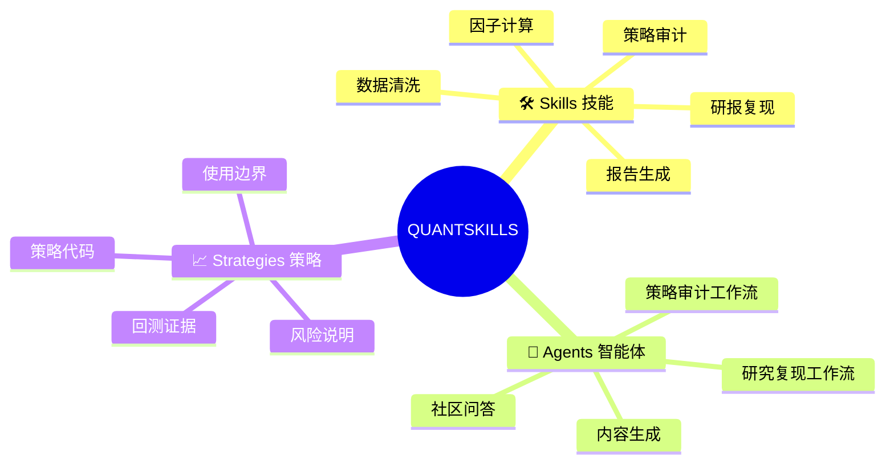
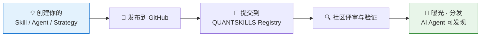
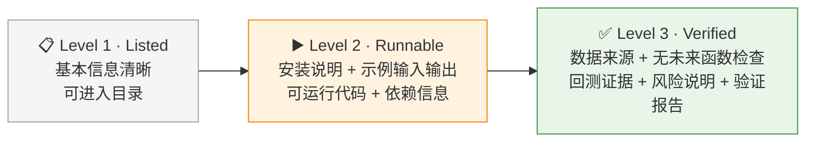
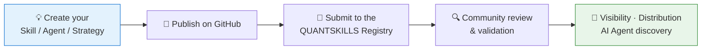
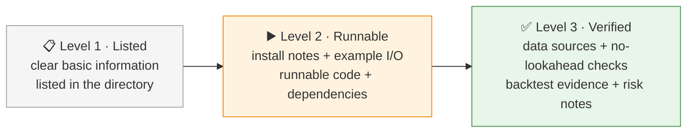

**简体中文** | [English](#english)

# 🐼 QUANTSKILLS

QUANTSKILLS 是 AI Agent 时代的开放量化社区，聚焦 **Quant Skills（量化技能）、Agents（智能体）、Strategies（策略）** 三类资产。

我们帮助量化开发者把交易经验、研究方法、因子模型和策略代码，转化为**可检索、可安装、可验证、可分享**的标准化资产。

> 把你的量化经验，变成人类可以信任、AI Agent 可以调用的 Skill。

## 🔗 官方入口

| 入口 | 链接 | 说明 |
|---|---|---|
| 🌐 官网 | https://quantskills.ai | 品牌叙事、Skill 发现、AI Agent 入口 |
| 🐙 GitHub 组织 | https://github.com/quantskills | 仓库、Issue、PR、社区评审与项目治理 |
| 📝 加入申请 | [提交 Join Request](https://github.com/quantskills/join/issues/new?template=join-request.yml) | 公开 Issue 表单申请加入 |
| 📜 社区规则 | [COMMUNITY_RULES.md](https://github.com/quantskills/join/blob/main/COMMUNITY_RULES.md) | 申请前请先阅读 |

## 🧩 我们收录什么

## 🗂️ 社区技能仓库一览

| 仓库 | 一句话说明 |
|---|---|
| [skill-pandadata-api](https://github.com/quantskills/skill-pandadata-api) | 185 个 Pandadata 数据接口的 Agent 技能：路由、契约校验、真实调用 |
| [skill-a-share-stock-dossier](https://github.com/quantskills/skill-a-share-stock-dossier) | A 股个股一键尽调：基本面、股东行为、质押解禁减持风险 |
| [skill-macro-monitor](https://github.com/quantskills/skill-macro-monitor) | 55 个宏观接口：指标查询、经济日历、行业景气度、宏观周报 |
| [skill-market-daily-review](https://github.com/quantskills/skill-market-daily-review) | A 股收盘复盘：指数估值、市场宽度、龙虎榜、两融北向，可定时 |
| [skill-futures-deepview-analyst](https://github.com/quantskills/skill-futures-deepview-analyst) | 期货 DeepView 研判：席位博弈、基差期限结构、仓单库存、跨期套利 |
| [skill-paper-replication](https://github.com/quantskills/skill-paper-replication) | 量化论文复现：arXiv 检索、PDF 提取、研究型回测 |
| [skill-report-replication](https://github.com/quantskills/skill-report-replication) | 量化研报复现：翻译、因子复现、有效性验证、本地回测 |
| [skill-quant-research-replication](https://github.com/quantskills/skill-quant-research-replication) | 研究复现全家桶：论文/研报/网页/文本 → 完整研究交付包 |
| [skill-ssquant-ai-trader](https://github.com/quantskills/skill-ssquant-ai-trader) | 自然语言 → 策略代码 → SIMNOW 模拟盘的 AI 交易执行引擎 |
| [skill-ssquant-trader-generator](https://github.com/quantskills/skill-ssquant-trader-generator) | AI 交易员"制造工厂"：把交易想法固化为可复用 Skill |
| [join](https://github.com/quantskills/join) | 社区加入申请入口 |

## 🚀 如何参与

贡献者可以获得：

- **曝光**：进入 QUANTSKILLS 目录、官网页面、精选列表与社区推荐
- **可信度**：获得 QS-Compatible、PandaData-Compatible、Backtest-Reproducible 等验证标签
- **分发**：让 Skill 可被未来的 AI Agent 搜索、安装、调用
- **协作**：参与策略共创、内容项目、企业项目、验证服务与付费 Skill
- **个人品牌**：从"我写了一个策略"，升级为"我发布了一个被社区收录和评审的量化 Skill"

早期阶段我们不强制统一模板：研究笔记、Prompt、Python 脚本、Agent 工作流、策略代码、数据校验、文档都可以是 Skill。

> 我们不用模板限制创造力，用注册与验证建立秩序。

## 📛 仓库命名

QUANTSKILLS 组织下的仓库应使用小写的 `skill-` 或 `agent-` 前缀。

- `skill-`：可复用能力，如因子、策略模板、数据处理、研报复现、验证工具、Prompt、示例或工具。
- `agent-`：AI Agent 或自动化工作流，如研究复现 Agent、策略审计 Agent、数据处理 Agent、评审 Agent 或多步任务系统。

每个仓库的根目录应包含一个声明文件：

- Skill 仓库：`SKILL.md`
- Agent 仓库：`AGENT.md`

声明文件或项目清单中应包含上游元数据，例如 QuantSkills 组织 URL、仓库名、仓库 URL、项目类型，以及（如适用）所属合集（collection）。

AI 辅助工具可以使用仓库名、`SKILL.md` / `AGENT.md`、README 与描述信息来协助维护公共注册表。最终的收录、推荐、验证或官方认定，仍需经过维护者评审。

完整仓库规则见 [COMMUNITY_RULES.md](https://github.com/quantskills/join/blob/main/COMMUNITY_RULES.md)。

## 🎖️ 验证等级

| 等级 | 适用对象 |
|---|---|
| 📋 **Listed** | 研究方法、Prompt 型 Skill、早期想法、教学示例 |
| ▶️ **Runnable** | 因子计算、数据处理、报告生成、简单策略脚本 |
| ✅ **Verified** | 因子研究、策略研究、回测系统、可交易策略示例 |

> 低门槛加入，高标准验证。

## 🤖 面向 AI Agent 的发现机制

QUANTSKILLS 同时为人类和 AI Agent 设计。我们将逐步建设：

- `llms.txt`
- Skills 索引 / Agents 索引
- MCP 服务
- GitHub README、Topics 与 Release 约定

目标：让 AI Agent 能够从社区**搜索、安装、调用、验证**量化能力。

## 🌍 语言政策

公开仓库的元数据、标题、摘要和关键文档以英文为主，方便全球贡献者与 AI Agent 理解和索引；同时支持中文、日文、韩文、西班牙文、法文、德文等语言用于讨论、教程、示例、研究笔记和社区协作。

任何语言的贡献都欢迎，只需附上简短的英文标题、摘要或 README 小节。

## 📜 社区规则摘要

- 尊重贡献者，保持建设性讨论。
- 不提交垃圾信息、误导性项目、违法内容、不安全代码、泄露数据或侵权材料。
- 不在公开 Issue、PR、README 或仓库中发布敏感信息（手机号、微信号、邮箱、证件号、密码、API Key、账户凭证）。
- 成员创建的仓库默认为 **Community Project**，未经评审不得宣称官方、认证、已验证或背书状态。
- 量化项目应明确说明数据来源、假设、局限和风险边界。
- 维护者可在必要时进行内容管理、归档、限制、转移或删除。

完整规则见 [COMMUNITY_RULES.md](https://github.com/quantskills/join/blob/main/COMMUNITY_RULES.md)。

## 🏛️ 仓库治理

成员可在 QUANTSKILLS 组织下创建并维护自己的社区项目。`github.com/quantskills` 下的仓库由 QUANTSKILLS 组织托管和治理：

- 项目创建者保留作品的**署名、荣誉与贡献历史**，并可按授予的权限维护仓库；
- 组织所有者保留最终治理权，必要时（安全问题、法律风险、垃圾信息、废弃项目、命名冲突、违反规则）可重命名、归档、转移、限制访问或删除仓库；
- 成员创建的仓库默认为社区项目，不自动代表 QUANTSKILLS 官方验证或背书，后续可按社区规则评审标记为 Listed / Runnable / Verified。

## 🎯 长期目标

如果你有一个量化方法、因子、策略、工具或工作流，QUANTSKILLS 要帮你把它发布成：**人类看得见、AI Agent 找得到、社区可验证**的 Skill。

---

# 🐼 QUANTSKILLS (English)

[简体中文](#chinese) | **English**

QUANTSKILLS is an open community for **Quant Skills, Agents, and Strategies** in the AI Agent era.

We help quant developers turn trading experience, research methods, factor models, and strategy code into standardized assets that can be **searched, installed, validated, and shared**.

> Turn your quant experience into Skills that humans can trust and AI Agents can use.

## 🔗 Official Links

| Entry | Link | Notes |
|---|---|---|
| 🌐 Website | https://quantskills.ai | Brand narrative, Skill discovery, AI Agent-facing entry points |
| 🐙 GitHub org | https://github.com/quantskills | Repositories, Issues, PRs, community review, governance |
| 📝 Join request | [Open a Join Request](https://github.com/quantskills/join/issues/new?template=join-request.yml) | Public issue-form application |
| 📜 Community rules | [COMMUNITY_RULES.md](https://github.com/quantskills/join/blob/main/COMMUNITY_RULES.md) | Please read before applying |

## 🧩 What We Collect

QUANTSKILLS focuses on three types of assets:

- **Skills**: factor calculation, data cleaning, strategy audit, research report replication, report generation, and other reusable capability packages
- **Agents**: research replication, strategy audit, content generation, community Q&A, and other AI Agent workflows
- **Strategies**: strategy assets with code, backtest evidence, risk notes, and clear usage boundaries

## 🗂️ Community Skill Repositories

| Repository | One-line summary |
|---|---|
| [skill-pandadata-api](https://github.com/quantskills/skill-pandadata-api) | Agent skill for 185 Pandadata APIs: routing, contract checking, real calls |
| [skill-a-share-stock-dossier](https://github.com/quantskills/skill-a-share-stock-dossier) | One-shot A-share due diligence: fundamentals, holder behavior, pledge/unlock risks |
| [skill-macro-monitor](https://github.com/quantskills/skill-macro-monitor) | 55 macro APIs: indicator lookup, economic calendar, industry prosperity, weekly reports |
| [skill-market-daily-review](https://github.com/quantskills/skill-market-daily-review) | A-share end-of-day review: indices, breadth, 龙虎榜, margin & northbound, schedulable |
| [skill-futures-deepview-analyst](https://github.com/quantskills/skill-futures-deepview-analyst) | Futures DeepView analysis: broker positions, basis & term structure, inventory, arbitrage |
| [skill-paper-replication](https://github.com/quantskills/skill-paper-replication) | Quant paper replication: arXiv search, PDF extraction, research backtests |
| [skill-report-replication](https://github.com/quantskills/skill-report-replication) | Research report replication: translation, factor reproduction, validation, local backtest |
| [skill-quant-research-replication](https://github.com/quantskills/skill-quant-research-replication) | Full research replication: paper/report/webpage/text → complete research package |
| [skill-ssquant-ai-trader](https://github.com/quantskills/skill-ssquant-ai-trader) | Natural language → strategy code → SIMNOW paper trading AI execution engine |
| [skill-ssquant-trader-generator](https://github.com/quantskills/skill-ssquant-trader-generator) | AI trader "factory": solidify trading ideas into reusable Skills |
| [join](https://github.com/quantskills/join) | Community join request entrance |

## 🚀 How to Participate

Contributors may gain:

- **Visibility**: be listed in QUANTSKILLS directories, website pages, curated lists, and community recommendations
- **Credibility**: earn labels such as QS-Compatible, PandaData-Compatible, Backtest-Reproducible, and other validation marks
- **Distribution**: make Skills searchable, installable, and callable by future AI Agents
- **Collaboration**: join strategy co-creation, content projects, enterprise projects, validation services, and paid Skills
- **Personal brand**: move from "I wrote a strategy" to "I published a quant Skill listed and reviewed by the community"

At the early stage, we do not force every contributor into a single fixed template. Skill formats can be very different: research notes, prompts, Python scripts, agent workflows, strategy code, data checks, or documentation.

> We do not use templates to limit creativity. We use registration and validation to build order.

## 📛 Repository Naming

Repositories under the QUANTSKILLS organization should use a lowercase `skill-`, `agent-`, or `strategy-` prefix.

- `skill-` is for reusable capabilities, such as factors, strategy templates, data processing, report replication, validation utilities, prompts, examples, or tools.
- `agent-` is for AI Agents or automated workflows, such as research replication agents, strategy audit agents, data processing agents, review agents, or multi-step task systems.
- `strategy-` is for strategy assets, especially trading rules, factor strategies, model strategies, portfolio workflows, or PandaAI QuantFlow-generated strategies with validation evidence.

Each repository should include a declaration file at the repository root:

- `SKILL.md` for Skill repositories
- `AGENT.md` for Agent repositories
- `STRATEGY.md` for Strategy repositories

The declaration file or project manifest should include upstream metadata such as the QuantSkills organization URL, repository name, repository URL, project type, and collection when applicable.

AI-assisted tools may use repository names, `SKILL.md` / `AGENT.md` / `STRATEGY.md`, README files, and descriptions to help maintain the public registry. Final listing, recommendation, validation, or official recognition still requires maintainer review.

Read the full repository rules: [COMMUNITY_RULES.md](https://github.com/quantskills/join/blob/main/COMMUNITY_RULES.md)

## 🎖️ Validation Levels

| Level | Suitable for |
|---|---|
| 📋 **Listed** | research methods, prompt-based Skills, early ideas, teaching examples |
| ▶️ **Runnable** | factor calculation, data processing, report generation, simple strategy scripts |
| ✅ **Verified** | factor research, strategy research, backtesting systems, tradable strategy examples |

> Low barrier to join. High standard for validation.

## 🤖 AI Agent Discovery

QUANTSKILLS is designed for both humans and AI Agents. We will gradually build:

- `llms.txt`
- skills index / agents index
- MCP services
- GitHub README, topics, and release conventions

The goal is to let AI Agents search, install, call, and validate quant capabilities from the community.

## 🌍 Languages

English is the primary language for public repository metadata, titles, summaries, and key documentation, so global contributors and AI Agents can understand and index the project.

We also support Chinese, Japanese, Korean, Spanish, French, German, and other widely used languages for discussions, tutorials, examples, research notes, and community collaboration.

Contributions in any language are welcome when they include enough English context, such as a short English title, summary, or README section.

## 📜 Community Rules Summary

- Respect contributors and keep discussions constructive.
- Do not submit spam, misleading projects, illegal content, unsafe code, leaked data, or infringing materials.
- Do not post sensitive information in public Issues, Pull Requests, README files, or repositories.
- Member-created repositories are Community Projects by default and must not claim official, certified, verified, or endorsed status unless reviewed.
- Quant projects should clearly state data sources, assumptions, limitations, and risk boundaries.
- Maintainers may moderate, archive, restrict, transfer, or delete content when necessary.

Read the full rules: [COMMUNITY_RULES.md](https://github.com/quantskills/join/blob/main/COMMUNITY_RULES.md)

## 🏛️ Repository Governance

Members may be allowed to create and maintain their own community projects under the QUANTSKILLS organization.

Repositories created under `github.com/quantskills` are hosted and governed within the QUANTSKILLS organization. Project creators keep authorship, credit, and contribution history for their work. The project creator may maintain the repository according to the permissions granted to them, while organization owners retain final governance rights.

Member-created repositories are Community Projects by default. They do not automatically represent official QUANTSKILLS validation or endorsement. Projects may later be reviewed and marked as Listed, Runnable, or Verified according to community rules.

Organization owners may rename, archive, transfer, restrict access to, or delete repositories when necessary, especially for security issues, legal risk, spam, abandoned projects, naming conflicts, or violations of community rules.

## 🎯 Long-Term Goal

If you have a quant method, factor, strategy, tool, or workflow, QUANTSKILLS should help you publish it as a Skill that **humans can see, AI Agents can discover, and the community can validate**.
