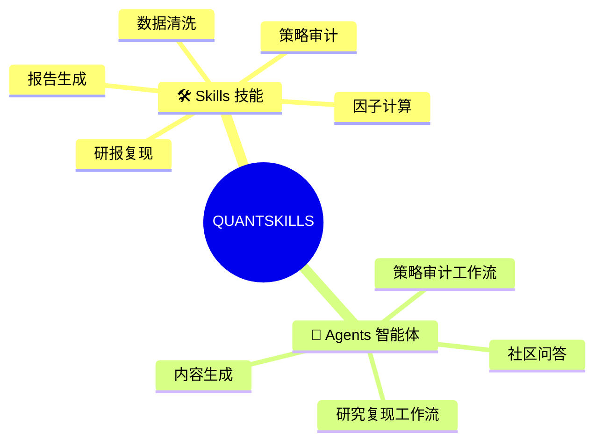
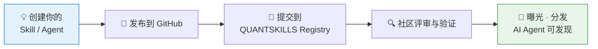
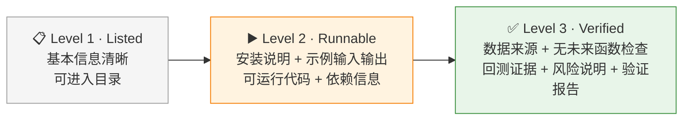
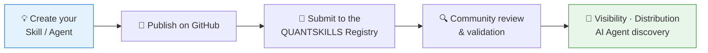
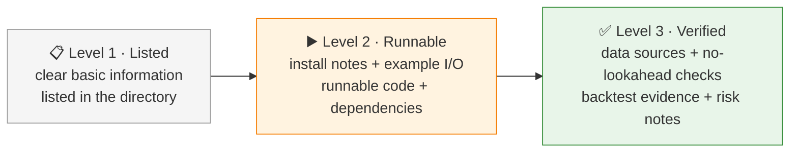

**简体中文** | [English](#english)

#  QUANTSKILLS

QUANTSKILLS 是 AI Agent 时代的开放量化社区，聚焦 **Quant Skills（量化技能）** 和 **Agents（智能体）** 两类资产。

QUANTSKILLS 由 PandaAI 发起，连接中文量化开发者与全球 AI 量化社区。PandaAI 在国内通过 [PandaAI Quant](https://www.pandaaiquant.com/) 服务本土用户，在国际通过 [TQX.ai](https://www.tqx.ai/) 面向全球开发者与研究者。

我们帮助量化开发者把交易经验、研究方法、因子模型和策略代码，转化为**可检索、可安装、可验证、可分享**的标准化资产。

> 把你的量化经验，变成人类可以信任、AI Agent 可以调用的 Skill。

## 🔗 官方入口

| 入口 | 链接 | 说明 |
|---|---|---|
| 🌐 官网 | https://quantskills.ai | 品牌叙事、Skill 发现、AI Agent 入口 |
| 🧭 资产导航 | [quantskills/quantskills](https://github.com/quantskills/quantskills) | Skill、因子、Agent 与组织资源的一站式可点击索引 |
| 📝 加入申请 | [提交 Join Request](https://github.com/quantskills/join/issues/new?template=join-request.yml) | 公开 Issue 表单申请加入 |
| 📜 社区规则 | [COMMUNITY_RULES.md](https://github.com/quantskills/join/blob/main/COMMUNITY_RULES.md) | 申请前请先阅读 |

## 🖥️ QuantStudio · 量化研究工作台

**让研究想法，走到真实交付。**

[**QuantStudio**](https://github.com/quantskills/QuantStudio/tree/main) 是 QuantSkills / PandaAI 的 AI 量化研究工作台，将技能、专家、专家团、数据与研究产物集中在同一个工作空间。用自然语言描述任务，在对话中推进研究，查看和下载实际生成的报告、图表、代码与文件；支持本地运行，也可部署为团队共享工作区。

  

**[查看项目与源码 →](https://github.com/quantskills/QuantStudio/tree/main)** · [快速开始](https://github.com/quantskills/QuantStudio#开始使用)

## 🧩 我们收录什么

```mermaid
mindmap
  root((QUANTSKILLS))
    🛠️ Skills 技能
      因子计算
      数据清洗
      策略审计
      研报复现
      报告生成
    🤖 Agents 智能体
      研究复现工作流
      策略审计工作流
      内容生成
      社区问答
```

## 🗂️ 社区技能仓库一览

| 仓库 / Repository | 简介 / Summary |
|---|---|
| [skill-a-share-market-participation](https://github.com/quantskills/skill-a-share-market-participation) | Analyze A-share cross-sectional market participation, turnover concentration, liquidity distribution, speculative crowding, leader dependence, and structural fragility from daily or intraday stock snapshots. Use when the user asks in Chinese or English to analyze A-share market breadth, participation, turnover concentration, crowding, whether an index rally is broad or narrow, or to generate a reproducible market-structure report. Use only bundled scripts with PandaData as the primary live source, AKShare as fallback, or user-provided local data; never search, browse, or scrape webpages for replacement market data, and fail closed when approved sources are unavailable. Do not use for order routing, fill simulation, slippage/TCA, live trade execution, or stock-level margin/northbound/block-trade capital-flow attribution. |
| [skill-a-share-market-risk-radar](https://github.com/quantskills/skill-a-share-market-risk-radar) | 扫描 A 股宏观、资金、估值、趋势、行业轮动与个股事件并汇总风险等级。 |
| [skill-a-share-pit-fundamental-vintage-builder](https://github.com/quantskills/skill-a-share-pit-fundamental-vintage-builder) | 按披露可见时点构建并审计 A 股财务数据，避免使用后续重述信息。 |
| [skill-a-share-stock-dossier](https://github.com/quantskills/skill-a-share-stock-dossier) | 输入一个 A 股代码，汇总基本面、公司行动、股东行为、事件风险与资金面的可溯源尽调报告。 |
| [skill-a-share-tradability-auditor](https://github.com/quantskills/skill-a-share-tradability-auditor) | A 股可交易性约束审计：把回测交易流放回历史行情，逐笔判定涨跌停封板、停牌、T+1、 裸卖空、新股窗口与参与率上限，把账面收益拆成"可成交收益"与"幽灵收益"， 并定位到具体交易。回答"这条净值曲线里有多少是市场根本不会给你的"。 |
| [skill-a1-lhb-tracking](https://github.com/quantskills/skill-a1-lhb-tracking) | 用龙虎榜席位历史表现和次日溢价生成事件驱动排序因子。 |
| [skill-ag-futures-seasonality](https://github.com/quantskills/skill-ag-futures-seasonality) | 从农产品期货日线计算各月份历史季节性并叠加作物日历生成可视化报告。 |
| [skill-ah-share-relative-value-montior](https://github.com/quantskills/skill-ah-share-relative-value-montior) | 监控A/H双重上市股票的汇率调整溢价、历史极值、脱钩与日频价格发现关系。 |
| [skill-alpha-a06-hotmoney-reversal](https://github.com/quantskills/skill-alpha-a06-hotmoney-reversal) | 从龙虎榜席位与行情数据计算热钱席位冷却反转因子并提供验证与回测产物。 |
| [skill-alpha-a3-streak-leader-relay](https://github.com/quantskills/skill-alpha-a3-streak-leader-relay) | 连板龙头接力（A3）Alpha 因子——从全 A 市场每日 ≥3 板候选池中识别 T+1 接力的事件型 top-N 信号，10 个子因子（个股截面 8 + 大盘情绪 2），权重可用 ICIR + shrinkage 重训，含滚动 IC gate 与 score 加权。研究层面的候选发现器，非交易策略。 |
| [skill-alpha-f1-position-change](https://github.com/quantskills/skill-alpha-f1-position-change) | 从期货前 20 席位净持仓变化计算持仓突变因子并生成信号。 |
| [skill-alpha-f5-member-position-concentration](https://github.com/quantskills/skill-alpha-f5-member-position-concentration) | 从机构、游资与北向等席位净持仓计算成员持仓集中度信号。 |
| [skill-alpha-f6-family-position-reverse](https://github.com/quantskills/skill-alpha-f6-family-position-reverse) | 从期货家族席位持仓反转关系计算交易信号。 |
| [skill-alpha-f8-family-main-divergence](https://github.com/quantskills/skill-alpha-f8-family-main-divergence) | 从期货家族席位与主力席位持仓背离计算因子信号。 |
| [skill-audit-opinion-scanner](https://github.com/quantskills/skill-audit-opinion-scanner) | 从审计意见、财务报表和行业对标评估 A 股财务健康并输出风险检查结果。 |
| [skill-b11-auto-stop-loss-take-profit](https://github.com/quantskills/skill-b11-auto-stop-loss-take-profit) | 按入场日期和开盘价规则判断止盈、止损、强平，并控制单票仓位上限。 |
| [skill-b12-intraday-position-manager](https://github.com/quantskills/skill-b12-intraday-position-manager) | 在日内交易中按可卖与锁定数量、价格和现金管理多标的仓位。 |
| [skill-b6-limitup-pool](https://github.com/quantskills/skill-b6-limitup-pool) | 维护每日涨停池，记录首板、连板、炸板、回封、题材和情绪指标并生成看板。 |
| [skill-b7-lhb-monitor](https://github.com/quantskills/skill-b7-lhb-monitor) | 监控龙虎榜与席位标签，生成次日关注清单和可筛选的个股详情看板。 |
| [skill-backtest](https://github.com/quantskills/skill-backtest) | 提供横截面多头回测协议，固定 T+1 开盘成交、费用、涨跌停剔除与诊断图表。 |
| [skill-backtest-assumption-check](https://github.com/quantskills/skill-backtest-assumption-check) | 独立的回测假设审计师：对回测代码/策略代码/研究报告按九大维度（成交时点、成本、涨跌停停牌、幸存者、多重比较、数据对齐、换手容量、基准、透明）逐条取证，输出缺陷×证据×严重度×影响×修复清单，配套可运行校验脚本。 |
| [skill-backtest-overfit](https://github.com/quantskills/skill-backtest-overfit) | 评估回测过拟合与多重检验风险，计算 DSR、PBO、净化交叉验证和 Harvey-Liu 折减。 |
| [skill-backtesting-bias-avoidance](https://github.com/quantskills/skill-backtesting-bias-avoidance) | 构建无前视偏差的回测并审计前视、幸存者、过拟合、成本和样本外检验风险。 |
| [skill-block-trade-radar](https://github.com/quantskills/skill-block-trade-radar) | 按大宗交易折溢价、成交量和价格证据生成 A 股个股雷达报告。 |
| [skill-buffett-moat-screener](https://github.com/quantskills/skill-buffett-moat-screener) | 按巴菲特式护城河、估值和点时数据筛选 A 股与美股公司并生成研究记录。 |
| [skill-buffett-moat-screener-lavine-version](https://github.com/quantskills/skill-buffett-moat-screener-lavine-version) | 基于 PandaData 点时证据执行十年资本回报与护城河硬筛选。 |
| [skill-build-b10-factor-evaluation](https://github.com/quantskills/skill-build-b10-factor-evaluation) | 评估因子的 IC、IR、分层回测、单调性、换手率和衰减表现。 |
| [skill-buyback-monitor](https://github.com/quantskills/skill-buyback-monitor) | 监测 A 股回购公告生命周期、用途、价格区间和强度并整理研究结果。 |
| [skill-calendar-anomaly-scanner](https://github.com/quantskills/skill-calendar-anomaly-scanner) | 从带日期收益序列扫描日历异常，结合稳健检验、Bootstrap 和多重检验校正输出结果。 |
| [skill-capital-flow-crowding-monitor](https://github.com/quantskills/skill-capital-flow-crowding-monitor) | 聚合融资融券、北向持股和大宗交易，计算资金一致性、背离与拥挤度分位信号。 |
| [skill-causal-alpha-discovery](https://github.com/quantskills/skill-causal-alpha-discovery) | Discover causal alpha factors from OHLCV data using causal discovery (PC + LiNGAM + NOTEARS), build Structural Causal Models, construct regime-invariant factor expressions, and validate through backtesting. Produces OHLCV-only alpha factors whose predictive power is grounded in causal mechanisms rather than spurious correlations. Use when an agent needs to discover stable alpha factors that survive regime changes, test whether existing factors are causal or merely correlational, or generate alpha factors with formal invariance guarantees on portable agent platforms such as Claude Code, Codex, or Codex-style skill systems. |
| [skill-cb-analyzer](https://github.com/quantskills/skill-cb-analyzer) | 分析 A 股可转债双低策略、条款事件、正股联动、Black-Scholes Greeks 与波动率。 |
| [skill-commodity-carry-cta](https://github.com/quantskills/skill-commodity-carry-cta) | 构建商品期货 carry、时序动量、横截面动量、基差动量和库存因子并回测轮动。 |
| [skill-concept-rotation-monitor](https://github.com/quantskills/skill-concept-rotation-monitor) | 监测 A 股概念与题材的动量、宽度和轮动变化并生成研究报告。 |
| [skill-corporate-action-adjustment-auditor](https://github.com/quantskills/skill-corporate-action-adjustment-auditor) | 在研究或回测前审计原始与复权价格中的拆分和现金分红一致性。 |
| [skill-cross-listing-parity](https://github.com/quantskills/skill-cross-listing-parity) | 比较 A/H 与中国 ADR 的跨市场价格平价、汇率和换股比例并输出监测报告。 |
| [skill-csrc-approval-pipeline](https://github.com/quantskills/skill-csrc-approval-pipeline) | A 股证监会批文进度追踪：按公告级别分类、审批流程监控、批文状态报告生成。 |
| [skill-daily-report](https://github.com/quantskills/skill-daily-report) | 汇总多个市场的行情、板块、资金和新闻数据，生成每日 Markdown 复盘报告。 |
| [skill-dalio-all-weather](https://github.com/quantskills/skill-dalio-all-weather) | 针对A股股票、债券、黄金和商品资产提供全天候配置与回测流程。 |
| [skill-derivatives-pricing-stochastic-calculus](https://github.com/quantskills/skill-derivatives-pricing-stochastic-calculus) | 输入期权合约与市场参数，输出可复现的定价与风险报告：BSM 解析价、全套希腊字母、二叉树与蒙特卡洛数值价、隐含波动率、平价与无套利校验，一次算清。 |
| [skill-disclosure-event-extractor](https://github.com/quantskills/skill-disclosure-event-extractor) | Turn unstructured A-share disclosure text from cninfo (巨潮) and the SSE/SZSE exchanges into a traceable, structured event table (监管问询/诉讼担保/重组/治理/ 停牌控制权变更/增减持/质押/业绩预告). Use when the user asks to scan A-share announcements, find 关注函/问询函/诉讼/停牌/易主 events, build an event table for factor or alert pipelines, or backtest disclosure events. Fills the information-search gap Pandadata does not cover. |
| [skill-dividend-yield-scan](https://github.com/quantskills/skill-dividend-yield-scan) | 计算A股滚动股息率、连续分红和除权除息日历。 |
| [skill-dl-autoencoder-anomaly](https://github.com/quantskills/skill-dl-autoencoder-anomaly) | 深度自编码器无监督异常检测 —— 用户问「今天哪些股票走势最异常」「沪深300 异常股」「AE 跑一下」「找不像自己往常样子的股票」类问题时触发。对沪深300成分股用最近60日窗口重训一个MLP自编码器，输出T日重建误差Top-10异常股，按「样式② 结构化播报」呈现。 |
| [skill-dl-gnn-stock-graph](https://github.com/quantskills/skill-dl-gnn-stock-graph) | 构建A股多层异构图并使用图神经网络进行量化选股与回测。 |
| [skill-dl-tcn-shortterm](https://github.com/quantskills/skill-dl-tcn-shortterm) | 使用因果扩张 Temporal Convolutional Network 对沪深 A 股分钟线执行未来 1、2、3、5 个交易日的横截面收益排序研究，并以同数据、切分和预算的 LSTM 作为基准，生成可审计的数据、训练、速度和预测效果证据。用于运行或诊断 TCN 短线预测、核验感受野与因果卷积、PIT/walk-forward/purge/embargo、防止未来泄漏、比较 RankIC/Top 区域指标与训练吞吐，或判断研究模型是否达到冻结候选条件；不用于组合换手优化、券商连接、实盘交易或收益承诺。 |
| [skill-dl-transformer-multiasset](https://github.com/quantskills/skill-dl-transformer-multiasset) | skill dl transformer multiasset |
| [skill-doc-to-alphas](https://github.com/quantskills/skill-doc-to-alphas) | 定义OHLCV因子表达式格式和校验规则，用于从文档生成Alpha因子。 |
| [skill-earnings-event-study](https://github.com/quantskills/skill-earnings-event-study) | 对财报/公司事件做正式 CAR 事件研究：异常收益、多窗口累计异常收益、截面 t 检验与符号检验；披露样本量与模型，不输出买卖建议。 |
| [skill-earnings-season-tracker](https://github.com/quantskills/skill-earnings-season-tracker) | 在财报季扫描业绩预告、行业分布和审计非标事项。 |
| [skill-equity-placard-watchlist](https://github.com/quantskills/skill-equity-placard-watchlist) | 举牌行为监控——侦测 A 股股东持股比例上穿 5%/10%/15%/20%/25%/30% 法定披露梯度的权益变动事件，含举牌梯度、意图倾向（财务 vs 战略）、6 个月锁定期、逼近举牌线观察名单。剔除通道账户与股本稀释造成的假举牌。BUILD 型 skill，可被复盘 agent 或事件驱动 Alpha 调用。 |
| [skill-etf-arbitrage-monitor](https://github.com/quantskills/skill-etf-arbitrage-monitor) | 监控A股ETF一级和二级市场折溢价及申赎篮子可行性。 |
| [skill-etf-flow-radar](https://github.com/quantskills/skill-etf-flow-radar) | 每日盘后 ETF 资金流雷达 —— 用户问「今天/最近 ETF 有什么异动」「ETF 资金流看下」「哪些 ETF 在被大量申购/赎回」「ETF 净申赎异动」类问题时触发。扫描主流权益 ETF，输出三类信号（净申赎异动 / 折溢价背离 / 连续多日大额同向），以「样式② 结构化播报」呈现给用户。 |
| [skill-etf-fund-evaluator](https://github.com/quantskills/skill-etf-fund-evaluator) | 评价境内非QDII被动股票指数ETF，并支持同指数横向比较。 |
| [skill-event-risk-alert](https://github.com/quantskills/skill-event-risk-alert) | 对自选或持仓清单扫描解禁、质押、增减持和业绩等事件风险。 |
| [skill-factor-alpha191-alpha101](https://github.com/quantskills/skill-factor-alpha191-alpha101) | 从长表OHLCV CSV批量计算Alpha101和Alpha191因子并输出宽表CSV。 |
| [skill-factor-backtest](https://github.com/quantskills/skill-factor-backtest) | 对给定因子和行情数据执行long-only横截面因子回测并生成诊断报告。 |
| [skill-factor-blend](https://github.com/quantskills/skill-factor-blend) | 将多个因子信号去冗余、加权并合成为复合信号。 |
| [skill-factor-debug](https://github.com/quantskills/skill-factor-debug) | 提供按症状、病因和验证手段组织的因子失效诊断手册。 |
| [skill-factor-decay](https://github.com/quantskills/skill-factor-decay) | 分析多期限Rank IC、换手和分组收益的衰减，并估计半衰期。 |
| [skill-factor-evaluate](https://github.com/quantskills/skill-factor-evaluate) | 对单个截面因子计算IC、夏普、回撤、单调性和换手的综合评分。 |
| [skill-factor-grouped-wrapper](https://github.com/quantskills/skill-factor-grouped-wrapper) | 按分组封装因子处理流程和工作流图。 |
| [skill-factor-ic-decay](https://github.com/quantskills/skill-factor-ic-decay) | 用日度截面 Spearman IC、ICIR、Newey-West 显著性、滚动稳定性与多周期半衰期，诊断因子预测力衰减；事实优先，不给买卖指令。 |
| [skill-factor-idea-generation](https://github.com/quantskills/skill-factor-idea-generation) | 根据默认数据范围生成包含经济逻辑和风险说明的因子候选想法。 |
| [skill-factor-loop-evolve](https://github.com/quantskills/skill-factor-loop-evolve) | 本地闭环因子研究系统：生成导入因子，验证，回测（PandaData真实A股数据），诊断，优化，经验记忆，生成新批次，迭代N轮，实现自我改进的因子发现与优化。 |
| [skill-factor-mason](https://github.com/quantskills/skill-factor-mason) | 检查单因子研究中的时点、IC/IR、成本和中性化质量。 |
| [skill-factor-mine](https://github.com/quantskills/skill-factor-mine) | 提供从假设、实验记录到评分和接受或回滚的因子挖掘SOP。 |
| [skill-factor-mining-pandaai](https://github.com/quantskills/skill-factor-mining-pandaai) | 使用PandaAI数据和分析反馈进行因子挖掘，或从公开文档提取因子。 |
| [skill-factor-optimize](https://github.com/quantskills/skill-factor-optimize) | 对已有股票或期货因子执行参数扫描、消融和版本增强。 |
| [skill-factor-orthogonalize](https://github.com/quantskills/skill-factor-orthogonalize) | 对截面因子进行逐日OLS正交化，并输出残差因子和暴露诊断。 |
| [skill-factor-pool-evolution](https://github.com/quantskills/skill-factor-pool-evolution) | 根据种子因子池的评估生成变异、交叉和推荐。 |
| [skill-factor-ranking-sage](https://github.com/quantskills/skill-factor-ranking-sage) | 在本地因子和标签数据上运行mRMR或Marginal-SAGE并输出Top-K排名。 |
| [skill-factor-review](https://github.com/quantskills/skill-factor-review) | 扫描因子库和实验日志，生成量化盘点、结构分析和研究建议。 |
| [skill-factormad-debate-factor-mining](https://github.com/quantskills/skill-factormad-debate-factor-mining) | 参考FactorMAD多智能体辩论框架进行可解释的股票Alpha因子挖掘。 |
| [skill-fin-news](https://github.com/quantskills/skill-fin-news) | 聚合财经快讯和市场数据，精选头条并撰写分析文章。 |
| [skill-forecast-calibration-audit](https://github.com/quantskills/skill-forecast-calibration-audit) | 审计概率预测的校准程度，而非只评估样本排序。 |
| [skill-fundamental-alpha](https://github.com/quantskills/skill-fundamental-alpha) | 基于基本面数据（PandaData）生成Alpha因子表达式，支持从研报/自然语言输入中提取估值、质量、成长、现金流、预期与股东信号，并通过公式合约与PIT面板验证。 |
| [skill-fundamental-factor-analysis](https://github.com/quantskills/skill-fundamental-factor-analysis) | 从季度财报计算并验证A股估值、质量和成长因子。 |
| [skill-futures-cta-alpha](https://github.com/quantskills/skill-futures-cta-alpha) | Commodity-futures CTA factor library — computes a structured date×variety factor panel (time-series & cross-sectional momentum, carry/roll, term structure, positioning/COT, inventory, volatility). Use when the user asks for 商品期货因子、 CTA 信号、动量/carry/期限结构/库存/持仓因子, a factor panel for futures backtesting, or futures factor IC. Fills the ecosystem gap of ZERO futures factor libraries (vs 10 for equities). Emits factor values for the factor toolchain (factor-evaluate / ic-analysis / backtest), NOT human-readable reports. |
| [skill-futures-deepview-analyst](https://github.com/quantskills/skill-futures-deepview-analyst) | 将期货DeepView自然语言请求转为数据调用计划和事实与推断分离的报告。 |
| [skill-futures-hedgecraft](https://github.com/quantskills/skill-futures-hedgecraft) | 当需要设计、审查或排错期货对冲、期货仓位 sizing、合约移仓、基差/carry 分析、日历价差、保证金压力测试或 CTA 风格期货配置时，使用此 skill。适用于股指期货、商品期货、利率期货和跨期价差场景，重点处理合约乘数、名义本金、保证金、期限结构、交割规则和压力损失。 |
| [skill-futures-investment-council](https://github.com/quantskills/skill-futures-investment-council) | Futures research Skill for analyzing, comparing, and screening futures markets with technical indicators, futures structure, and committee-style reports. Use when Codex needs to analyze a futures symbol, compare futures symbols, screen futures candidates, explain signal changes, or generate a structured futures research report without stock analysis, auto-trading, or deterministic buy/sell promises. |
| [skill-futures-roll-auditor](https://github.com/quantskills/skill-futures-roll-auditor) | 审计连续合约选择、换月价差和调整因子，并生成换月账本。 |
| [skill-futures-transition-crowding-factor](https://github.com/quantskills/skill-futures-transition-crowding-factor) | 从期货合约迁移与拥挤转移构造可审计横截面因子 |
| [skill-gaetano-crux-capital-research-model](https://github.com/quantskills/skill-gaetano-crux-capital-research-model) | 以公开资料拆解光子、光网络和AI基础设施公司的研究证据与风险。 |
| [skill-gao-shanwen-research-model](https://github.com/quantskills/skill-gao-shanwen-research-model) | 整理、检索和学习高善文公开著作与文章。 |
| [skill-global-commodity-term-structure](https://github.com/quantskills/skill-global-commodity-term-structure) | 用公开数据研究海外商品期货期限结构、展期收益和价差。 |
| [skill-global-macro-rates-fx-lab](https://github.com/quantskills/skill-global-macro-rates-fx-lab) | 以公开利率、央行和外汇数据生成可溯源的全球宏观格局简报。 |
| [skill-global-macro-trend-strategy](https://github.com/quantskills/skill-global-macro-trend-strategy) | 将海外信号和公开日线价格转为可回测的研究策略、仓位和风控规则。 |
| [skill-graham-netnet-screener](https://github.com/quantskills/skill-graham-netnet-screener) | 当需要开发、计算、验证 Graham 净净营运资本(NCAV) 因子时，使用此 skill。适用于 A 股全市场深度价值筛选，排除银行/房地产/非银金融，计算 NCAV 折价因子并生成 buy/sell/hold 信号。 |
| [skill-graph-spectral-diffusion-factor](https://github.com/quantskills/skill-graph-spectral-diffusion-factor) | 在点时股票关系图上构造可审计的因子扩散与局部残差 |
| [skill-guarantee-risk-scan](https://github.com/quantskills/skill-guarantee-risk-scan) | A 股累计担保风险扫描：担保比率、超额担保、高负债率担保占比监控与预警报告。 |
| [skill-hk-stock-dossier](https://github.com/quantskills/skill-hk-stock-dossier) | 基于Pandadata接口生成覆盖九个维度的港股尽职调查研报。 |
| [skill-hk-us-consensus-radar](https://github.com/quantskills/skill-hk-us-consensus-radar) | 汇总港美股卖方评级、目标价和成长预期及其变化。 |
| [skill-hk-us-consensus-revision-radar](https://github.com/quantskills/skill-hk-us-consensus-revision-radar) | 组织港美股目标价和评级的跨期修订轨迹，并生成研究报告。 |
| [skill-hk-us-dividend-events](https://github.com/quantskills/skill-hk-us-dividend-events) | 基于Pandadata外盘接口生成港股和美股分红事件报告。 |
| [skill-hk-us-fundamental-factor](https://github.com/quantskills/skill-hk-us-fundamental-factor) | Build, standardize, compare, and validate multi-factor fundamental panels for Hong Kong and US equities from PandaAI operating, market-financial, industry-median, price-volume, and financial-statement APIs. Use for quality, value, growth, momentum, low-risk, composite-score, percentile-rank, or cross-market stock-screening tasks. |
| [skill-hk-us-insider-radar](https://github.com/quantskills/skill-hk-us-insider-radar) | 扫描港股和美股内部人交易、净买卖方向、聚集交易及持股变化。 |
| [skill-hk-us-institutional-concentration](https://github.com/quantskills/skill-hk-us-institutional-concentration) | Build, compare, and validate institutional ownership structure panels for Hong Kong and US equities with PandaAI investor concentration, ranking, and shareholder-report APIs. Use for ownership breadth, top-holder dominance, HHI, controlling-holder risk, evidence confidence, or within-market institutional ownership screening. |
| [skill-hk-us-quote-scan](https://github.com/quantskills/skill-hk-us-quote-scan) | 生成港美股行情、流动性、估值和行业相对位置的研究快照。 |
| [skill-holder-structure-scan](https://github.com/quantskills/skill-holder-structure-scan) | 跟踪A股股东户数、前十大持股和自由流通股以评估筹码集中度。 |
| [skill-ic-analysis](https://github.com/quantskills/skill-ic-analysis) | 评估量化因子的IC、分组表现和预测有效性。 |
| [skill-index-rebalance-event-study](https://github.com/quantskills/skill-index-rebalance-event-study) | 围绕指数纳入、剔除和权重调整公告或生效日运行可复现事件研究。 |
| [skill-index-valuation-rotation](https://github.com/quantskills/skill-index-valuation-rotation) | 分析A股指数估值分位、行业相对估值和轮动线索。 |
| [skill-institutional-research-tracker](https://github.com/quantskills/skill-institutional-research-tracker) | 监测A股机构调研活动、关注度及其变化。 |
| [skill-intraday-data-quality-auditor](https://github.com/quantskills/skill-intraday-data-quality-auditor) | 审计标准化日内OHLCV数据的时间戳、缺口、价格、成交量和交易日缺陷。 |
| [skill-investment-decision](https://github.com/quantskills/skill-investment-decision) | 整合研究证据、估值和风险信息，形成可追溯的投资决策报告。 |
| [skill-jq-to-panda-converter](https://github.com/quantskills/skill-jq-to-panda-converter) | 将聚宽量化策略代码转换为可运行回测的PandaAI JSON策略配置。 |
| [skill-keynes-contrarian-investment](https://github.com/quantskills/skill-keynes-contrarian-investment) | 运用长期预期和反共识框架识别过度乐观、悲观及价值陷阱。 |
| [skill-klarman-special-situations](https://github.com/quantskills/skill-klarman-special-situations) | 按特殊情况投资框架研究定增解禁、重组、分拆和困境反转事件。 |
| [skill-kline-pattern-vision](https://github.com/quantskills/skill-kline-pattern-vision) | 用截图或只读 PandaData 行情识别股票/期货K线趋势结构、蜡烛线和候选图表形态，支持日线与1/5/10/15/30/60分钟线，输出证据、确认条件、失效条件和不确定性。 |
| [skill-llm-alpha-generator](https://github.com/quantskills/skill-llm-alpha-generator) | Mine formulaic alpha factors end to end: LLM 主导生成候选公式 → 三层校验（白名单/量纲/前视）→ warm-start 遗传编程精修 → AlphaEval 五维打分 → LLM 经济解释 → 自包含 HTML 报告，返回结构化因子结果。Use when the user wants to mine/discover alpha factors, generate formulaic (expression-tree) trading factors, run LLM+GP factor search, or evaluate factor predictive power (RankIC) on stocks or futures. 只挖因子、不做回测（回测归另一 skill）。 |
| [skill-llm-rag-financial-qa](https://github.com/quantskills/skill-llm-rag-financial-qa) | 财报公告 RAG 问答系统——就一家 A 股公司的财报/公告提问，给出带官方引用、可核对、拒绝编造的回答。三路路由（数字精确算 / 底仓文本检索 / 官方全文按需）+ 引用纪律 + 拒答。数据源 PandaData 优先、官方披露网页为次级源。BUILD 型 skill，可被复盘 agent 或投研 agent 调用。 |
| [skill-ma-crossover-signal](https://github.com/quantskills/skill-ma-crossover-signal) | 计算均线交叉交易信号并提供回测评估。 |
| [skill-macro-altdata-nowcast](https://github.com/quantskills/skill-macro-altdata-nowcast) | 利用宏观另类高频数据进行行业景气度现在预测和趋势观察。 |
| [skill-macro-futures-scenario-analysis](https://github.com/quantskills/skill-macro-futures-scenario-analysis) | 基于 PandaData 的宏观事件—期货预期分析：读取宏观经济日历的实际值、市场预期与前值，结合期货价格、成交量、持仓量、基差、期限结构、库存与仓单，对沪金、沪铜、原油及用户指定品种输出基准、偏强、偏弱情景。当用户询问「美国CPI对期货影响」「宏观事件期货预期」「美联储对商品影响」「期货供需与宏观共振」「事件公布前情景」时触发。仅作条件化研究，不承诺涨跌或生成自动交易指令。 |
| [skill-macro-monitor](https://github.com/quantskills/skill-macro-monitor) | 监测宏观数据、行业景气、经济日历和周期性宏观变化。 |
| [skill-market-daily-review](https://github.com/quantskills/skill-market-daily-review) | 生成基于Pandadata的A股收盘后每日市场复盘报告。 |
| [skill-market-regime-analysis](https://github.com/quantskills/skill-market-regime-analysis) | 结合指数、宏观、期货期限结构和波动率特征划分A股市场状态。 |
| [skill-material-contract-alpha](https://github.com/quantskills/skill-material-contract-alpha) | A 股重大合同 Alpha 因子：基于合同金额对数和的横截面排序信号。 |
| [skill-microstructure-vwap-deviation](https://github.com/quantskills/skill-microstructure-vwap-deviation) | Minute-bar VWAP deviation strategy research and auditable SSQuant futures validation. Use for rolling VWAP deviation signals, confirmed mean reversion, trend guards, next-bar execution, execution-cost modeling, frozen-data backtests, and trade-result review. |
| [skill-minuteflow-alpha](https://github.com/quantskills/skill-minuteflow-alpha) | 基于分钟级行情数据（PandaData）生成Alpha因子表达式，支持从研报/自然语言输入中提取日内微观结构信号（VWAP偏离、订单流代理、日内动量衰减、波动率曲线等），并通过公式合约验证。 |
| [skill-ml-factor-ensemble](https://github.com/quantskills/skill-ml-factor-ensemble) | 用防泄漏滚动验证将机器学习模型集成为因子元信号。 |
| [skill-ml-purged-cv](https://github.com/quantskills/skill-ml-purged-cv) | 审计任意金融特征、可训练时序模型或候选策略收益，并执行防泄漏的 Purged K-Fold、Embargo、CPCV、Causal Walk-Forward、PBO、DSR、Governed Holdout 与 Temporal Forward Evidence。用于检查未来函数、信息区间重叠、特征可用时间和血缘、Fold-Local 预处理、CPCV Path 稳健性、策略选择过拟合、预测是否在标签成熟前登记，以及在接受金融模型或策略前生成结构化验证证据。 |
| [skill-model-hpo-evidence-driven](https://github.com/quantskills/skill-model-hpo-evidence-driven) | 以固定验证流程和试验级证据优化量化多因子模型超参数。 |
| [skill-munger-mental-model](https://github.com/quantskills/skill-munger-mental-model) | 运用多元思维模型框架生成公司投资研究和判断报告。 |
| [skill-news-sentiment-analyst](https://github.com/quantskills/skill-news-sentiment-analyst) | 采集、核验并分析A股财经新闻情绪，生成研究报告。 |
| [skill-northbound-margin-monitor](https://github.com/quantskills/skill-northbound-margin-monitor) | 监测北向资金、融资融券和期货全景的多类风险信号。 |
| [skill-numerical-leak-check](https://github.com/quantskills/skill-numerical-leak-check) | 通过数值测试检测量化研究流程中的前视和数据泄漏。 |
| [skill-oil-brief](https://github.com/quantskills/skill-oil-brief) | 整合期货、EIA、OPEC和市场数据生成中文原油简报。 |
| [skill-optimal-transport-cross-sectional-factor](https://github.com/quantskills/skill-optimal-transport-cross-sectional-factor) | 用点时截面分布的单调最优传输构造可审计因子 |
| [skill-option-strategy-builder](https://github.com/quantskills/skill-option-strategy-builder) | 构建期权策略腿组合、损益图、盈亏平衡、希腊字母和保证金分析。 |
| [skill-options-vol-analyst](https://github.com/quantskills/skill-options-vol-analyst) | 分析期权链、隐含与历史波动率、期限结构、偏度和波动率溢价。 |
| [skill-overseas-equity-factor-miner](https://github.com/quantskills/skill-overseas-equity-factor-miner) | 发现并以IC、衰减和换手率验证港美股横截面alpha因子。 |
| [skill-oversold-rebound](https://github.com/quantskills/skill-oversold-rebound) | 判断A股短期超跌反弹环境并筛选候选股票。 |
| [skill-pair-correlation](https://github.com/quantskills/skill-pair-correlation) | 计算和解释资产对的相关性、滚动关系及其研究用途。 |
| [skill-pandaai-factor-online](https://github.com/quantskills/skill-pandaai-factor-online) | 支持PandaAI因子大赛环境配置、在线挖掘、批量回测和成本复盘。 |
| [skill-pandaai-workflow-audit](https://github.com/quantskills/skill-pandaai-workflow-audit) | 审计PandaAI工作流的图结构、代码、时序、参数和回测验证证据。 |
| [skill-pandaai-workflow-generator](https://github.com/quantskills/skill-pandaai-workflow-generator) | 根据量化想法生成可导入PandaAI的工作流JSON及策略或因子代码。 |
| [skill-pandadata-api](https://github.com/quantskills/skill-pandadata-api) | 为多种智能体运行时提供Pandadata市场和研究数据API调用与契约查询。 |
| [skill-pandadata-warehouse](https://github.com/quantskills/skill-pandadata-warehouse) | 管理本地Pandadata DuckDB和Parquet量化数据仓库、缓存和查询流程。 |
| [skill-paper-replication](https://github.com/quantskills/skill-paper-replication) | 支持论文检索、数据提取、实验复现和研究结果报告。 |
| [skill-performance-attribution](https://github.com/quantskills/skill-performance-attribution) | A股量化策略绩效归因：三层综合归因（Alpha/Beta/择时 + Brinson 配置/选择/交互 + 因子收益归因含风格行业与 Alpha 残差），输出统一归因报告并做分解对账。与 skill-risk-model（风险归因）互补。 |
| [skill-portfolio-attribution](https://github.com/quantskills/skill-portfolio-attribution) | 将组合主动收益分解为行业配置、个股选择、交互效应和因子贡献。 |
| [skill-portfolio-blacklitterman](https://github.com/quantskills/skill-portfolio-blacklitterman) | Black-Litterman 组合优化 —— 用户问「跑一下 BL 组合」「基于视图的组合权重」「相对沪深300 的主动配置」「动量/反转/换手视图对权重的影响」类问题时触发。以沪深300 指数权重为先验，用动量/反转/换手率三条因子视图更新，输出长权重组合，按「样式② 结构化播报」呈现给用户。 |
| [skill-portfolio-checkup](https://github.com/quantskills/skill-portfolio-checkup) | 汇总持仓集中度、基准偏离、估值、质量和风险暴露生成组合健康报告。 |
| [skill-portfolio-cvar-optim](https://github.com/quantskills/skill-portfolio-cvar-optim) | 当需要开发、计算、验证 CVaR 尾部风险最小化组合时，使用此 skill。在预期收益约束下最小化组合 95% CVaR，支持极值理论(EVT/GPD)尾部补样、组合权重求解、样本外验证。 |
| [skill-portfolio-liquidity-stress-test](https://github.com/quantskills/skill-portfolio-liquidity-stress-test) | 在成交量压力下估算组合清算天数、期限内变现、赎回缺口和冲击成本。 |
| [skill-portfolio-optimize](https://github.com/quantskills/skill-portfolio-optimize) | 将alpha信号转为受权重、行业、暴露和换手约束的优化组合权重。 |
| [skill-portfolio-pnl-attribution](https://github.com/quantskills/skill-portfolio-pnl-attribution) | 按证券和行业归因组合已实现收益，并对账费用、基准和输入质量。 |
| [skill-portfolio-risk-parity](https://github.com/quantskills/skill-portfolio-risk-parity) | 当需要开发、计算、验证风险平价（等风险贡献 ERC）组合时使用。手写 Ledoit-Wolf 收缩协方差稳定相关性，scipy SLSQP 求 ERC 权重，支持指数/期货/ETF 三类资产与月度 rebalance。 |
| [skill-post-market-screener](https://github.com/quantskills/skill-post-market-screener) | 收盘后结合技术形态和资金流筛选 A 股股票并生成报告。 |
| [skill-qbti](https://github.com/quantskills/skill-qbti) | 通过五部分问答将用户偏好转换为因子方向和策略参数。 |
| [skill-quant-execution-microstructure](https://github.com/quantskills/skill-quant-execution-microstructure) | 将已批准的交易目标转化为可观测的成本感知执行方案。 |
| [skill-quant-factor-directional-alpha](https://github.com/quantskills/skill-quant-factor-directional-alpha) | 提供用于趋势、突破和反转研究的 OHLCV 方向因子库。 |
| [skill-quant-factor-risk-pattern-alpha](https://github.com/quantskills/skill-quant-factor-risk-pattern-alpha) | 提供用于波动、K 线形态和回撤压力研究的 OHLCV 因子库。 |
| [skill-quant-factor-skill-factory](https://github.com/quantskills/skill-quant-factor-skill-factory) | 批量生成、验证并打包框架中立的 OHLCV 因子技能。 |
| [skill-quant-portfolio-risk](https://github.com/quantskills/skill-quant-portfolio-risk) | 分析组合风险暴露、约束和压力情景。 |
| [skill-quant-research](https://github.com/quantskills/skill-quant-research) | 指导量化研究、回测设计和统计验证工作流。 |
| [skill-quant-research-experiment-registry](https://github.com/quantskills/skill-quant-research-experiment-registry) | 登记量化实验并审计其可复现性证据。 |
| [skill-quant-strategy-diagnostics](https://github.com/quantskills/skill-quant-strategy-diagnostics) | 检查策略或因子近期是否恶化，列出收益、IC、回撤、换手率和市场状态方面的证据。 |
| [skill-refinancing-monitor](https://github.com/quantskills/skill-refinancing-monitor) | 跟踪 A 股再融资生命周期、定价和稀释风险。 |
| [skill-regulatory-risk-radar](https://github.com/quantskills/skill-regulatory-risk-radar) | 汇总 A 股监管与合规风险事件并进行分级。 |
| [skill-report-replication](https://github.com/quantskills/skill-report-replication) | 指导将研究报告转化为可复现的分析流程。 |
| [skill-residual-guided-factor-selection](https://github.com/quantskills/skill-residual-guided-factor-selection) | 使用残差 IC 和样本外评估筛选因子组合。 |
| [skill-risk-model](https://github.com/quantskills/skill-risk-model) | 构建多因子风险模型并进行风险归因。 |
| [skill-risk-return-metrics](https://github.com/quantskills/skill-risk-return-metrics) | 计算投资组合或策略的风险收益指标。 |
| [skill-rl-portfolio-allocator](https://github.com/quantskills/skill-rl-portfolio-allocator) | skill rl portfolio allocator |
| [skill-rolling-beta-exposure](https://github.com/quantskills/skill-rolling-beta-exposure) | 估计资产或组合相对于基准的滚动贝塔暴露。 |
| [skill-rotation-radar](https://github.com/quantskills/skill-rotation-radar) | 当需要分析市场状态、行业轮动、ETF 强弱排序、市场宽度、风格切换或战术配置信号时，使用此 skill。适用于 A 股、港股、美股和 ETF 池的行业轮动分析、risk-on/risk-off 状态识别、相对强弱排名、宽度确认、假突破过滤和轮动失效条件设计。 |
| [skill-serenity-research-model](https://github.com/quantskills/skill-serenity-research-model) | 从公开 X/Twitter 证据重建 Serenity 风格的研究逻辑。 |
| [skill-shortterm-mean-reversal](https://github.com/quantskills/skill-shortterm-mean-reversal) | A 股五交易日收益率横截面反转因子与成本敏感回测。 |
| [skill-signal-portfolio-optimize](https://github.com/quantskills/skill-signal-portfolio-optimize) | 将单个股票信号转换为受基准相对风险、风格、行业、换手和成本约束的可审计组合权重。 |
| [skill-signal-stability-audit](https://github.com/quantskills/skill-signal-stability-audit) | 审计量化信号跨期和跨样本的稳定性。 |
| [skill-simons-pairs-trading](https://github.com/quantskills/skill-simons-pairs-trading) | 研究 A 股配对交易的协整、价差和执行约束。 |
| [skill-smart-money-profiler](https://github.com/quantskills/skill-smart-money-profiler) | 分析龙虎榜席位、北向行为与资金共识或分歧。 |
| [skill-soros-reflexivity-detector](https://github.com/quantskills/skill-soros-reflexivity-detector) | 索罗斯反身性识别器——用双环模型（快环情绪-资金 / 慢环基本面-资本）判断 A 股"这波涨跌是不是自我强化的反身性、转到哪一圈、燃料和裂缝在哪"，做阶段识别与仓位纪律。BUILD 型 skill，可被复盘 agent 或 Alpha 调用。 |
| [skill-ssquant-ai-trader](https://github.com/quantskills/skill-ssquant-ai-trader) | 组织 SSQuant 策略研究、模拟交易和运行检查。 |
| [skill-ssquant-trader-generator](https://github.com/quantskills/skill-ssquant-trader-generator) | 将自然语言交易想法转换为可复用的 Trader Skill，并委托模拟部署流程。 |
| [skill-statistical-arbitrage-time-series](https://github.com/quantskills/skill-statistical-arbitrage-time-series) | 构建统计套利时间序列研究并生成可追溯报告。 |
| [skill-stock-memory-analyzer-usa](https://github.com/quantskills/skill-stock-memory-analyzer-usa) | 对美国存储芯片股票开展多维度研究分析。 |
| [skill-stock-score](https://github.com/quantskills/skill-stock-score) | skill stock score |
| [skill-stock-screener](https://github.com/quantskills/skill-stock-screener) | 依据自然语言筛选条件和 Pandadata 证据筛选 A 股股票。 |
| [skill-strategy-capacity-tca](https://github.com/quantskills/skill-strategy-capacity-tca) | 用成交与 ADV 估计参与率、平方根/线性冲击成本与容量曲线，回答「策略能承载多少资金、成本何时吃掉 alpha」——估计非保证，不作交易建议。 |
| [skill-strategy-performance-report](https://github.com/quantskills/skill-strategy-performance-report) | Use when an agent needs to generate a periodic performance report for a LIVE A-share quant strategy — 日报/周报/月报/半年报/年报 or custom period — covering returns, risk, trade analysis, and position/turnover detail, with embedded visualizations. Outputs a self-contained offline HTML dashboard (interactive ECharts) plus Markdown + JSON. |
| [skill-strategy-tearsheet-report](https://github.com/quantskills/skill-strategy-tearsheet-report) | 生成包含风险调整指标的策略绩效 tearsheet。 |
| [skill-survivorship-universe-auditor](https://github.com/quantskills/skill-survivorship-universe-auditor) | 审计回测前的点时证券池成员、标识和退市收益数据。 |
| [skill-template](https://github.com/quantskills/skill-template) | 提供 QuantSkills 技能项目的模板结构和说明。 |
| [skill-templeton-global-contrarian](https://github.com/quantskills/skill-templeton-global-contrarian) | 当需要开发、计算、验证 Templeton 全球价值多因子 V2 时，使用此 skill。适用于 A 股/港股/美股跨市场价值筛选，基于 EP/BP/SP/股息/ROE/杠杆/动量 七子因子截面打分，生成 buy/sell/hold 信号。 |
| [skill-time-series-analysis](https://github.com/quantskills/skill-time-series-analysis) | 对金融时间序列进行诊断并生成分析报告。 |
| [skill-tqx-data-research](https://github.com/quantskills/skill-tqx-data-research) | skill tqx research |
| [skill-trade-review](https://github.com/quantskills/skill-trade-review) | 把交易流水转成结构化复盘结果，包含归因、逐笔点评、错误模式、建议和可选 LLM 总结。 |
| [skill-transaction-cost-analysis](https://github.com/quantskills/skill-transaction-cost-analysis) | 将成交记录相对 VWAP/TWAP 分解为多类交易成本。 |
| [skill-transaction-cost-calibration](https://github.com/quantskills/skill-transaction-cost-calibration) | 从成交和市场数据校准佣金、价差、滑点与冲击成本假设。 |
| [skill-trendline-breakdown-reversal](https://github.com/quantskills/skill-trendline-breakdown-reversal) | 计算A股日线下跌突破划线压力位反转因子，识别下破下降压力线后反转确认的个股；当用户提供交易日期、要求自动获取当日全市场A股行情、量化选股、因子研究或回测时使用。 |
| [skill-us-sec-edgar-harvester](https://github.com/quantskills/skill-us-sec-edgar-harvester) | 采集并结构化美国 SEC EDGAR 公开申报文件。 |
| [skill-us-sector-rotation](https://github.com/quantskills/skill-us-sector-rotation) | 生成美国行业表现、估值和轮动的事实性报告。 |
| [skill-walk-forward-validator](https://github.com/quantskills/skill-walk-forward-validator) | 用净化和隔离的滚动窗口验证截面信号的样本外表现。 |
| [skill-x-trader-builder](https://github.com/quantskills/skill-x-trader-builder) | 从公开 X/Twitter 帖子数据构建交易者专属研究模型技能。 |
| [skill-xingtai-catcher](https://github.com/quantskills/skill-xingtai-catcher) | 根据文字或图像描述检索相似的 A 股和期货 K 线形态。 |

## 🤖 社区 Agent 仓库一览

| 仓库 / Repository | 简介 / Summary |
|---|---|
| [agent-alpha-portfolio-guardian](https://github.com/quantskills/agent-alpha-portfolio-guardian) | 多因子组合健康度守卫：健康度矩阵 + 拥挤警示 + 退休/重构候选 + IC 衰减曲线，含守卫规则有效性回测 L4。 |
| [agent-corporate-governance-scanner](https://github.com/quantskills/agent-corporate-governance-scanner) | 公司治理综合评分 Agent，9维度治理风险打分+证据链 |
| [agent-correlation-break-research](https://github.com/quantskills/agent-correlation-break-research) | 用 Pandadata 多资产收益相关性变化识别风格切换、分散化压力与结构性行情。 |
| [agent-crowding-risk-monitor](https://github.com/quantskills/agent-crowding-risk-monitor) | 用 Pandadata 价格、成交、融资和龙虎榜热度识别抱团、过热、踩踏与去杠杆风险。 |
| [agent-derivatives-skew-sentiment-monitor](https://github.com/quantskills/agent-derivatives-skew-sentiment-monitor) | 用期权隐含波动率和标的历史波动率观察衍生品市场风险偏好。 |
| [agent-earnings-surprise-hunter](https://github.com/quantskills/agent-earnings-surprise-hunter) | 财报季 Surprise/暴雷猎手 Agent。获取财报预告、一致预期、审计意见，计算偏离度并生成分析报告。支持A股/港股/美股。 |
| [agent-feng-reverse](https://github.com/quantskills/agent-feng-reverse) | 追踪微博"峰哥亡命天涯"的发言，提取股票/市场观点，生成反向操作信号。峰哥是A股知名反向指标，其公开观点具有稳定的反向参考价值。 |
| [agent-for-liangshuyuan-tasks](https://github.com/quantskills/agent-for-liangshuyuan-tasks) | 面向量枢院任务的多 Agent 协作框架，组织量化交易工具、构建流程与任务分工。 |
| [agent-future-trading](https://github.com/quantskills/agent-future-trading) | 多智能体期货研究、策略生成、历史回测与研究反馈工作流 |
| [agent-intraday-rl-timing](https://github.com/quantskills/agent-intraday-rl-timing) | 纯研究的日内强化学习实验台：分钟数据建 Gym 环境 + 基线策略(TWAP/动量/反转) + 防泄漏 walk-forward 训练评估，绝不实盘下单。 |
| [agent-macro-driven-rotation](https://github.com/quantskills/agent-macro-driven-rotation) | 以改进美林时钟定相、景气 Nowcast 和估值过滤生成宏观驱动行业轮动研究材料。 |
| [agent-market-regime-monitor](https://github.com/quantskills/agent-market-regime-monitor) | 用 Pandadata 行情、指数宽度、波动率和资金证据判断趋势、震荡、退潮或风险扩张状态。 |
| [agent-quantspace](https://github.com/quantskills/agent-quantspace) | 面向 AI 编码代理的量化研究框架，组织数据、技能、策略、回测和报告工作流。 |
| [agent-ssquant](https://github.com/quantskills/agent-ssquant) | SSQuant Agent 组织期货策略、数据服务、CTP 门禁检查和中文回测报告工作流。 |
| [agent-template](https://github.com/quantskills/agent-template) | 用于创建可移植 QuantSkills 智能体项目的规范模板。 |

## 🚀 如何参与

```mermaid
flowchart LR
    A["💡 创建你的<br/>Skill / Agent"] --> B["🐙 发布到 GitHub"]
    B --> C["📮 提交到<br/>QUANTSKILLS Registry"]
    C --> D["🔍 社区评审与验证"]
    D --> E["🌟 曝光 · 分发<br/>AI Agent 可发现"]

    style A fill:#e3f2fd,stroke:#1976d2
    style E fill:#e8f5e9,stroke:#388e3c
```

贡献者可以获得：

- **曝光**：进入 QUANTSKILLS 目录、官网页面、精选列表与社区推荐
- **可信度**：获得 QS-Compatible、PandaData-Compatible、Backtest-Reproducible 等验证标签
- **分发**：让 Skill 可被未来的 AI Agent 搜索、安装、调用
- **协作**：参与策略共创、内容项目、企业项目、验证服务与付费 Skill
- **个人品牌**：从"我写了一个策略"，升级为"我发布了一个被社区收录和评审的量化 Skill"

早期阶段我们不强制统一模板：研究笔记、Prompt、Python 脚本、Agent 工作流、策略代码、数据校验、文档都可以是 Skill。

> 我们不用模板限制创造力，用注册与验证建立秩序。

## 📛 仓库命名

QUANTSKILLS 组织下的仓库应使用小写的 `skill-` 或 `agent-` 前缀。

- `skill-`：可复用能力，如因子、策略模板、数据处理、研报复现、验证工具、Prompt、示例或工具。
- `agent-`：AI Agent 或自动化工作流，如研究复现 Agent、策略审计 Agent、数据处理 Agent、评审 Agent 或多步任务系统。

每个仓库的根目录应包含一个声明文件：

- Skill 仓库：`SKILL.md`
- Agent 仓库：`AGENTS.md`

声明文件或项目清单中应包含上游元数据，例如 QuantSkills 组织 URL、仓库名、仓库 URL、项目类型，以及（如适用）所属合集（collection）。

AI 辅助工具可以使用仓库名、`SKILL.md` / `AGENTS.md`、README 与描述信息来协助维护公共注册表。最终的收录、推荐、验证或官方认定，仍需经过维护者评审。

完整仓库规则见 [COMMUNITY_RULES.md](https://github.com/quantskills/join/blob/main/COMMUNITY_RULES.md)。

## 🎖️ 验证等级

```mermaid
flowchart LR
    L1["📋 Level 1 · Listed<br/>基本信息清晰<br/>可进入目录"] --> L2["▶️ Level 2 · Runnable<br/>安装说明 + 示例输入输出<br/>可运行代码 + 依赖信息"]
    L2 --> L3["✅ Level 3 · Verified<br/>数据来源 + 无未来函数检查<br/>回测证据 + 风险说明 + 验证报告"]

    style L1 fill:#f5f5f5,stroke:#9e9e9e
    style L2 fill:#fff3e0,stroke:#f57c00
    style L3 fill:#e8f5e9,stroke:#388e3c
```

| 等级 | 适用对象 |
|---|---|
| 📋 **Listed** | 研究方法、Prompt 型 Skill、早期想法、教学示例 |
| ▶️ **Runnable** | 因子计算、数据处理、报告生成、简单策略脚本 |
| ✅ **Verified** | 因子研究、策略研究、回测系统、可交易策略示例 |

> 低门槛加入，高标准验证。

## 🤖 面向 AI Agent 的发现机制

QUANTSKILLS 同时为人类和 AI Agent 设计。我们将逐步建设：

- `llms.txt`
- Skills 索引 / Agents 索引
- MCP 服务
- GitHub README、Topics 与 Release 约定

目标：让 AI Agent 能够从社区**搜索、安装、调用、验证**量化能力。

## 🌍 语言政策

公开仓库的元数据、标题、摘要和关键文档以英文为主，方便全球贡献者与 AI Agent 理解和索引；同时支持中文、日文、韩文、西班牙文、法文、德文等语言用于讨论、教程、示例、研究笔记和社区协作。

任何语言的贡献都欢迎，只需附上简短的英文标题、摘要或 README 小节。

## 📜 社区规则摘要

- 尊重贡献者，保持建设性讨论。
- 不提交垃圾信息、误导性项目、违法内容、不安全代码、泄露数据或侵权材料。
- 不在公开 Issue、PR、README 或仓库中发布敏感信息（手机号、微信号、邮箱、证件号、密码、API Key、账户凭证）。
- 成员创建的仓库默认为 **Community Project**，未经评审不得宣称官方、认证、已验证或背书状态。
- 量化项目应明确说明数据来源、假设、局限和风险边界。
- 维护者可在必要时进行内容管理、归档、限制、转移或删除。

完整规则见 [COMMUNITY_RULES.md](https://github.com/quantskills/join/blob/main/COMMUNITY_RULES.md)。

## 🏛️ 仓库治理

成员可在 QUANTSKILLS 组织下创建并维护自己的社区项目。`github.com/quantskills` 下的仓库由 QUANTSKILLS 组织托管和治理：

- 项目创建者保留作品的**署名、荣誉与贡献历史**，并可按授予的权限维护仓库；
- 组织所有者保留最终治理权，必要时（安全问题、法律风险、垃圾信息、废弃项目、命名冲突、违反规则）可重命名、归档、转移、限制访问或删除仓库；
- 成员创建的仓库默认为社区项目，不自动代表 QUANTSKILLS 官方验证或背书，后续可按社区规则评审标记为 Listed / Runnable / Verified。

## 🎯 长期目标

如果你有一个量化方法、因子、策略、工具或工作流，QUANTSKILLS 要帮你把它发布成：**人类看得见、AI Agent 找得到、社区可验证**的 Skill。

## 🐼 PandaAI 社群

  
   
  扫码加入 PandaAI 社群，交流 QUANTSKILLS 技能、Agent 工作流与量化研究实践。

---

#  QUANTSKILLS (English)

[简体中文](#chinese) | **English**

QUANTSKILLS is an open community for **Quant Skills and Agents** in the AI Agent era.

Initiated by PandaAI, QUANTSKILLS connects Chinese quant developers with the global AI quant community. PandaAI serves local users through [PandaAI Quant](https://www.pandaaiquant.com/) and international developers and researchers through [TQX.ai](https://www.tqx.ai/).

We help quant developers turn trading experience, research methods, factor models, and strategy code into standardized assets that can be **searched, installed, validated, and shared**.

> Turn your quant experience into Skills that humans can trust and AI Agents can use.

## 🔗 Official Links

| Entry | Link | Notes |
|---|---|---|
| 🌐 Website | https://quantskills.ai | Brand narrative, Skill discovery, AI Agent-facing entry points |
| 🧭 Asset navigator | [quantskills/quantskills](https://github.com/quantskills/quantskills) | One-stop clickable index for Skills, factors, Agents, and organization resources |
| 📝 Join request | [Open a Join Request](https://github.com/quantskills/join/issues/new?template=join-request.yml) | Public issue-form application |
| 📜 Community rules | [COMMUNITY_RULES.md](https://github.com/quantskills/join/blob/main/COMMUNITY_RULES.md) | Please read before applying |

## 🧩 What We Collect

QUANTSKILLS focuses on two types of assets:

- **Skills**: factor calculation, data cleaning, strategy audit, research report replication, report generation, and other reusable capability packages
- **Agents**: research replication, strategy audit, content generation, community Q&A, and other AI Agent workflows

## 🗂️ Community Skill Repositories

| 仓库 / Repository | 简介 / Summary |
|---|---|
| [skill-a-share-market-participation](https://github.com/quantskills/skill-a-share-market-participation) | Analyze A-share cross-sectional market participation, turnover concentration, liquidity distribution, speculative crowding, leader dependence, and structural fragility from daily or intraday stock snapshots. Use when the user asks in Chinese or English to analyze A-share market breadth, participation, turnover concentration, crowding, whether an index rally is broad or narrow, or to generate a reproducible market-structure report. Use only bundled scripts with PandaData as the primary live source, AKShare as fallback, or user-provided local data; never search, browse, or scrape webpages for replacement market data, and fail closed when approved sources are unavailable. Do not use for order routing, fill simulation, slippage/TCA, live trade execution, or stock-level margin/northbound/block-trade capital-flow attribution. |
| [skill-a-share-market-risk-radar](https://github.com/quantskills/skill-a-share-market-risk-radar) | Scans A-share macro, funding, valuation, trend, sector-rotation, and event evidence into risk levels. |
| [skill-a-share-pit-fundamental-vintage-builder](https://github.com/quantskills/skill-a-share-pit-fundamental-vintage-builder) | Builds and audits point-in-time A-share financial data without later restatements. |
| [skill-a-share-stock-dossier](https://github.com/quantskills/skill-a-share-stock-dossier) | Uses Pandadata to produce a sourced A-share dossier covering fundamentals, corporate actions, holders, event risks, and market funds. |
| [skill-a-share-tradability-auditor](https://github.com/quantskills/skill-a-share-tradability-auditor) | A-share tradability-constraint auditor — replays a backtest or signal trade log against date-resolved price limits (10%/20%/30%; main-board ST was 5% until the 2026-07-06 rule change), locked vs intraday-opened limit bars, suspensions, T+1 settlement, the naked-short ban, the new-listing window and turnover participation caps, then splits headline PnL into executable PnL and phantom PnL. Use when the user asks 回测收益是不是真的能成交、涨停买不进、 跌停卖不出、停牌怎么处理、T+1 约束、一字板、可交易性/可成交性审计, or wants to know why a live account underperforms its backtest. Fills the ecosystem gap: the four existing auditors all check whether the DATA is right, none checks whether the EXECUTION ASSUMPTION is possible. |
| [skill-a1-lhb-tracking](https://github.com/quantskills/skill-a1-lhb-tracking) | Generates an event-ranking factor from Dragon-Tiger seat history, win rate, payoff, and next-session premium. |
| [skill-ag-futures-seasonality](https://github.com/quantskills/skill-ag-futures-seasonality) | Computes monthly agricultural-futures seasonality from daily prices and overlays crop-calendar context. |
| [skill-ah-share-relative-value-montior](https://github.com/quantskills/skill-ah-share-relative-value-montior) | Monitor FX-adjusted A/H premiums, historical extremes, dislocations, and daily cross-market price-discovery proxies. |
| [skill-alpha-a06-hotmoney-reversal](https://github.com/quantskills/skill-alpha-a06-hotmoney-reversal) | Computes a hot-money seat cooling and reversal factor from Dragon-Tiger and market data with validation artifacts. |
| [skill-alpha-a3-streak-leader-relay](https://github.com/quantskills/skill-alpha-a3-streak-leader-relay) | 连板龙头接力（A3）Alpha 因子——从全 A 市场每日 ≥3 板候选池中识别 T+1 接力的事件型 top-N 信号，10 个子因子（个股截面 8 + 大盘情绪 2），权重可用 ICIR + shrinkage 重训，含滚动 IC gate 与 score 加权。研究层面的候选发现器，非交易策略。 |
| [skill-alpha-f1-position-change](https://github.com/quantskills/skill-alpha-f1-position-change) | Computes a futures top-20-seat position-change factor and signal from net-position data. |
| [skill-alpha-f5-member-position-concentration](https://github.com/quantskills/skill-alpha-f5-member-position-concentration) | Computes member-position concentration signals from institutional, hot-money, and northbound net positions. |
| [skill-alpha-f6-family-position-reverse](https://github.com/quantskills/skill-alpha-f6-family-position-reverse) | Computes a futures family-position reversal signal from seat-position relationships. |
| [skill-alpha-f8-family-main-divergence](https://github.com/quantskills/skill-alpha-f8-family-main-divergence) | Computes a futures family-versus-main-seat position-divergence factor signal. |
| [skill-audit-opinion-scanner](https://github.com/quantskills/skill-audit-opinion-scanner) | Assesses A-share financial health from audit opinions, statements, and industry benchmarks with risk checks. |
| [skill-b11-auto-stop-loss-take-profit](https://github.com/quantskills/skill-b11-auto-stop-loss-take-profit) | Applies entry-date and open-price rules for take-profit, stop-loss, forced exits, and single-name position caps. |
| [skill-b12-intraday-position-manager](https://github.com/quantskills/skill-b12-intraday-position-manager) | Manages intraday multi-instrument positions using sellable and locked quantity, price, and cash inputs. |
| [skill-b6-limitup-pool](https://github.com/quantskills/skill-b6-limitup-pool) | Maintains a daily limit-up pool with board, break, reseal, theme, sentiment, and dashboard outputs. |
| [skill-b7-lhb-monitor](https://github.com/quantskills/skill-b7-lhb-monitor) | Monitors Dragon-Tiger entries and seat labels to produce next-session watchlists and searchable views. |
| [skill-backtest](https://github.com/quantskills/skill-backtest) | Provides a cross-sectional long-only backtest protocol with T+1 execution, fees, limit filters, and diagnostics. |
| [skill-backtest-assumption-check](https://github.com/quantskills/skill-backtest-assumption-check) | Use when an agent needs to independently audit the assumptions and biases behind a backtest / strategy code / research backtest report — execution timing and lookahead, trading costs, price limits and suspensions, survivorship bias, parameter freedom and multiple testing, data alignment and adjustment, turnover and capacity, benchmark and excess returns, and reporting transparency. Outputs a structured defect list (axis x evidence x severity x impact x fix). |
| [skill-backtest-overfit](https://github.com/quantskills/skill-backtest-overfit) | Evaluates backtest overfitting and multiple-testing risk with DSR, PBO, purged cross-validation, and Harvey-Liu haircut. |
| [skill-backtesting-bias-avoidance](https://github.com/quantskills/skill-backtesting-bias-avoidance) | Builds look-ahead-safe backtests and audits leakage, survivorship, overfitting, costs, and out-of-sample checks. |
| [skill-block-trade-radar](https://github.com/quantskills/skill-block-trade-radar) | Builds an A-share block-trade radar from discount or premium, volume, and price evidence. |
| [skill-buffett-moat-screener](https://github.com/quantskills/skill-buffett-moat-screener) | Screens A-share and US companies using moat, valuation, and point-in-time data for research records. |
| [skill-buffett-moat-screener-lavine-version](https://github.com/quantskills/skill-buffett-moat-screener-lavine-version) | PandaData-only point-in-time Buffett moat hard screener for A-shares. |
| [skill-build-b10-factor-evaluation](https://github.com/quantskills/skill-build-b10-factor-evaluation) | Evaluates quantitative factors with IC, IR, stratified backtests, monotonicity, turnover, and decay diagnostics. |
| [skill-buyback-monitor](https://github.com/quantskills/skill-buyback-monitor) | Monitors A-share buyback lifecycles, purposes, price ranges, and intensity for research. |
| [skill-calendar-anomaly-scanner](https://github.com/quantskills/skill-calendar-anomaly-scanner) | Scans dated price changes for calendar anomalies using robust tests, bootstrap checks, and multiple-testing control. |
| [skill-capital-flow-crowding-monitor](https://github.com/quantskills/skill-capital-flow-crowding-monitor) | Aggregates margin, northbound-holding, and block-trade data into consensus, divergence, and crowding-percentile signals. |
| [skill-causal-alpha-discovery](https://github.com/quantskills/skill-causal-alpha-discovery) | Discover causal alpha factors from OHLCV data using causal discovery (PC + LiNGAM + NOTEARS), build Structural Causal Models, construct regime-invariant factor expressions, and validate through backtesting. Produces OHLCV-only alpha factors whose predictive power is grounded in causal mechanisms rather than spurious correlations. Use when an agent needs to discover stable alpha factors that survive regime changes, test whether existing factors are causal or merely correlational, or generate alpha factors with formal invariance guarantees on portable agent platforms such as Claude Code, Codex, or Codex-style skill systems. |
| [skill-cb-analyzer](https://github.com/quantskills/skill-cb-analyzer) | Analyzes A-share convertible bonds with double-low screening, terms, equity linkage, Greeks, and volatility. |
| [skill-commodity-carry-cta](https://github.com/quantskills/skill-commodity-carry-cta) | Builds commodity-futures carry, time-series momentum, cross-sectional momentum, basis, and inventory factors for rotation backtests. |
| [skill-concept-rotation-monitor](https://github.com/quantskills/skill-concept-rotation-monitor) | Monitors A-share concept and theme momentum, breadth, and rotation for research reports. |
| [skill-corporate-action-adjustment-auditor](https://github.com/quantskills/skill-corporate-action-adjustment-auditor) | Audits split and cash-dividend consistency between raw and adjusted equity prices before research. |
| [skill-cross-listing-parity](https://github.com/quantskills/skill-cross-listing-parity) | Monitors A/H and China ADR cross-listing parity using prices, FX, and share ratios. |
| [skill-csrc-approval-pipeline](https://github.com/quantskills/skill-csrc-approval-pipeline) | A-share CSRC approval pipeline tracking: categorization by announcement level, approval flow monitoring, and status report generation. |
| [skill-daily-report](https://github.com/quantskills/skill-daily-report) | Aggregates cross-market prices, sectors, flows, and news into a daily Markdown review. |
| [skill-dalio-all-weather](https://github.com/quantskills/skill-dalio-all-weather) | Provides an all-weather allocation and backtest workflow for A-share assets, bonds, gold, and commodities. |
| [skill-derivatives-pricing-stochastic-calculus](https://github.com/quantskills/skill-derivatives-pricing-stochastic-calculus) | Price options and other derivatives and quantify their risk from a contract specification and market inputs, covering Black-Scholes-Merton analytical pricing, the full set of Greeks, binomial-tree and Monte-Carlo numerical pricing with convergence checks, implied-volatility inversion, volatility smile/skew structure, and model-risk validation (put-call parity, no-arbitrage bounds, cross-method consistency). Use when the user asks for 期权定价、希腊字母计算、隐含波动率、波动率微笑/曲面、二叉树或蒙特卡洛定价、Black-Scholes、美式期权定价、看跌看涨平价校验, or a one-stop option pricing and risk dossier. |
| [skill-disclosure-event-extractor](https://github.com/quantskills/skill-disclosure-event-extractor) | Turn unstructured A-share disclosure text from cninfo (巨潮) and the SSE/SZSE exchanges into a traceable, structured event table (监管问询/诉讼担保/重组/治理/ 停牌控制权变更/增减持/质押/业绩预告). Use when the user asks to scan A-share announcements, find 关注函/问询函/诉讼/停牌/易主 events, build an event table for factor or alert pipelines, or backtest disclosure events. Fills the information-search gap Pandadata does not cover. |
| [skill-dividend-yield-scan](https://github.com/quantskills/skill-dividend-yield-scan) | Calculates A-share rolling dividend yield, dividend continuity, and ex-dividend calendars. |
| [skill-dl-autoencoder-anomaly](https://github.com/quantskills/skill-dl-autoencoder-anomaly) | 深度自编码器无监督异常检测 —— 用户问「今天哪些股票走势最异常」「沪深300 异常股」「AE 跑一下」「找不像自己往常样子的股票」类问题时触发。对沪深300成分股用最近60日窗口重训一个MLP自编码器，输出T日重建误差Top-10异常股，按「样式② 结构化播报」呈现。 |
| [skill-dl-gnn-stock-graph](https://github.com/quantskills/skill-dl-gnn-stock-graph) | Builds A-share heterogeneous graphs for GNN stock selection and backtesting. |
| [skill-dl-tcn-shortterm](https://github.com/quantskills/skill-dl-tcn-shortterm) | 使用因果扩张 Temporal Convolutional Network 对沪深 A 股分钟线执行未来 1、2、3、5 个交易日的横截面收益排序研究，并以同数据、切分和预算的 LSTM 作为基准，生成可审计的数据、训练、速度和预测效果证据。用于运行或诊断 TCN 短线预测、核验感受野与因果卷积、PIT/walk-forward/purge/embargo、防止未来泄漏、比较 RankIC/Top 区域指标与训练吞吐，或判断研究模型是否达到冻结候选条件；不用于组合换手优化、券商连接、实盘交易或收益承诺。 |
| [skill-dl-transformer-multiasset](https://github.com/quantskills/skill-dl-transformer-multiasset) | skill dl transformer multiasset |
| [skill-doc-to-alphas](https://github.com/quantskills/skill-doc-to-alphas) | Defines OHLCV alpha-expression formats and validation rules for document-derived factors. |
| [skill-earnings-event-study](https://github.com/quantskills/skill-earnings-event-study) | Formal CAR event study around earnings/corporate events — abnormal returns, multi-window CARs, t-tests and sign tests, with sample and model disclosure; research only, no trading advice. |
| [skill-earnings-season-tracker](https://github.com/quantskills/skill-earnings-season-tracker) | Scans earnings guidance, industry distributions, and qualified audit items during earnings seasons. |
| [skill-equity-placard-watchlist](https://github.com/quantskills/skill-equity-placard-watchlist) | 举牌行为监控——侦测 A 股股东持股比例上穿 5%/10%/15%/20%/25%/30% 法定披露梯度的权益变动事件，含举牌梯度、意图倾向（财务 vs 战略）、6 个月锁定期、逼近举牌线观察名单。剔除通道账户与股本稀释造成的假举牌。BUILD 型 skill，可被复盘 agent 或事件驱动 Alpha 调用。 |
| [skill-etf-arbitrage-monitor](https://github.com/quantskills/skill-etf-arbitrage-monitor) | Monitors A-share ETF primary/secondary-market premiums and redemption-basket feasibility. |
| [skill-etf-flow-radar](https://github.com/quantskills/skill-etf-flow-radar) | 每日盘后 ETF 资金流雷达 —— 用户问「今天/最近 ETF 有什么异动」「ETF 资金流看下」「哪些 ETF 在被大量申购/赎回」「ETF 净申赎异动」类问题时触发。扫描主流权益 ETF，输出三类信号（净申赎异动 / 折溢价背离 / 连续多日大额同向），以「样式② 结构化播报」呈现给用户。 |
| [skill-etf-fund-evaluator](https://github.com/quantskills/skill-etf-fund-evaluator) | Evaluates domestic non-QDII passive equity-index ETFs and comparable-index peers. |
| [skill-event-risk-alert](https://github.com/quantskills/skill-event-risk-alert) | Scans watchlists or holdings for unlock, pledge, ownership-change, and earnings-event risks. |
| [skill-factor-alpha191-alpha101](https://github.com/quantskills/skill-factor-alpha191-alpha101) | Computes Alpha101 and Alpha191 factors from long-form OHLCV CSV and outputs wide CSV. |
| [skill-factor-backtest](https://github.com/quantskills/skill-factor-backtest) | Runs long-only cross-sectional factor backtests on supplied factors and market data with diagnostics. |
| [skill-factor-blend](https://github.com/quantskills/skill-factor-blend) | De-redundantly weights and combines multiple factor signals into a composite signal. |
| [skill-factor-debug](https://github.com/quantskills/skill-factor-debug) | Provides a symptom, cause, and verification playbook for factor failures. |
| [skill-factor-decay](https://github.com/quantskills/skill-factor-decay) | Analyzes decay in Rank IC, turnover, and bucket returns and estimates half-life. |
| [skill-factor-evaluate](https://github.com/quantskills/skill-factor-evaluate) | Scores a cross-sectional factor using IC, Sharpe, drawdown, monotonicity, and turnover. |
| [skill-factor-grouped-wrapper](https://github.com/quantskills/skill-factor-grouped-wrapper) | Wraps grouped factor-processing workflows and their pipeline diagrams. |
| [skill-factor-ic-decay](https://github.com/quantskills/skill-factor-ic-decay) | Diagnose factor IC decay, ICIR, significance, rolling stability, and multi-horizon half-life. Evidence-first, no trading signals. |
| [skill-factor-idea-generation](https://github.com/quantskills/skill-factor-idea-generation) | Generates candidate factor ideas with economic rationale and risk notes from the default data scope. |
| [skill-factor-loop-evolve](https://github.com/quantskills/skill-factor-loop-evolve) | Local closed-loop factor research: generate, validate, backtest, diagnose, learn, iterate N rounds. Self-improving alpha discovery and optimization. |
| [skill-factor-mason](https://github.com/quantskills/skill-factor-mason) | Checks timing, IC/IR, costs, and neutralization quality in single-factor research. |
| [skill-factor-mine](https://github.com/quantskills/skill-factor-mine) | Provides a factor-mining SOP from hypothesis and experiment notes through scoring and accept/rollback. |
| [skill-factor-mining-pandaai](https://github.com/quantskills/skill-factor-mining-pandaai) | Mines factors with PandaAI data and feedback or extracts them from public documents. |
| [skill-factor-optimize](https://github.com/quantskills/skill-factor-optimize) | Runs parameter sweeps, ablations, and version refinements for existing equity or futures factors. |
| [skill-factor-orthogonalize](https://github.com/quantskills/skill-factor-orthogonalize) | Orthogonalizes cross-sectional factors with daily OLS and outputs residual factors and exposure diagnostics. |
| [skill-factor-pool-evolution](https://github.com/quantskills/skill-factor-pool-evolution) | Generates mutation, crossover, and recommendations from evaluated seed factor pools. |
| [skill-factor-ranking-sage](https://github.com/quantskills/skill-factor-ranking-sage) | Runs mRMR or Marginal-SAGE on local factor and label data to produce Top-K rankings. |
| [skill-factor-review](https://github.com/quantskills/skill-factor-review) | Scans a factor library and experiment logs for inventory, structural analysis, and research recommendations. |
| [skill-factormad-debate-factor-mining](https://github.com/quantskills/skill-factormad-debate-factor-mining) | Uses a FactorMAD-style multi-agent debate framework for interpretable stock-alpha mining. |
| [skill-fin-news](https://github.com/quantskills/skill-fin-news) | Aggregates financial headlines and market data to select headlines and draft analysis articles. |
| [skill-forecast-calibration-audit](https://github.com/quantskills/skill-forecast-calibration-audit) | Audits probability-forecast calibration rather than sample ranking alone. |
| [skill-fundamental-alpha](https://github.com/quantskills/skill-fundamental-alpha) | Generate alpha factor expressions from fundamental data (PandaData). Accepts a document, URL, natural language query, or model invention and returns validated point-in-time factors. |
| [skill-fundamental-factor-analysis](https://github.com/quantskills/skill-fundamental-factor-analysis) | Computes and validates A-share valuation, quality, and growth factors from quarterly financial reports. |
| [skill-futures-cta-alpha](https://github.com/quantskills/skill-futures-cta-alpha) | Commodity-futures CTA factor library — computes a structured date×variety factor panel (time-series & cross-sectional momentum, carry/roll, term structure, positioning/COT, inventory, volatility). Use when the user asks for 商品期货因子、 CTA 信号、动量/carry/期限结构/库存/持仓因子, a factor panel for futures backtesting, or futures factor IC. Fills the ecosystem gap of ZERO futures factor libraries (vs 10 for equities). Emits factor values for the factor toolchain (factor-evaluate / ic-analysis / backtest), NOT human-readable reports. |
| [skill-futures-deepview-analyst](https://github.com/quantskills/skill-futures-deepview-analyst) | Turns futures DeepView natural-language requests into data-call plans and fact/inference-separated reports. |
| [skill-futures-hedgecraft](https://github.com/quantskills/skill-futures-hedgecraft) | 当需要设计、审查或排错期货对冲、期货仓位 sizing、合约移仓、基差/carry 分析、日历价差、保证金压力测试或 CTA 风格期货配置时，使用此 skill。适用于股指期货、商品期货、利率期货和跨期价差场景，重点处理合约乘数、名义本金、保证金、期限结构、交割规则和压力损失。 |
| [skill-futures-investment-council](https://github.com/quantskills/skill-futures-investment-council) | Futures research Skill for analyzing, comparing, and screening futures markets with technical indicators, futures structure, and committee-style reports. Use when Codex needs to analyze a futures symbol, compare futures symbols, screen futures candidates, explain signal changes, or generate a structured futures research report without stock analysis, auto-trading, or deterministic buy/sell promises. |
| [skill-futures-roll-auditor](https://github.com/quantskills/skill-futures-roll-auditor) | Audits continuous-contract selection, roll gaps, and adjustment factors and produces a roll ledger. |
| [skill-futures-transition-crowding-factor](https://github.com/quantskills/skill-futures-transition-crowding-factor) | Build an auditable futures factor from contract transitions and crowding shifts |
| [skill-gaetano-crux-capital-research-model](https://github.com/quantskills/skill-gaetano-crux-capital-research-model) | Uses public sources to structure research evidence and risks for photonics, optical-network, and AI-infrastructure companies. |
| [skill-gao-shanwen-research-model](https://github.com/quantskills/skill-gao-shanwen-research-model) | Organizes, retrieves, and studies Gao Shanwen's public writings and articles. |
| [skill-global-commodity-term-structure](https://github.com/quantskills/skill-global-commodity-term-structure) | Uses public data to study global commodity-futures term structure, roll yield, and spreads. |
| [skill-global-macro-rates-fx-lab](https://github.com/quantskills/skill-global-macro-rates-fx-lab) | Produces sourced global macro briefs from public rates, central-bank, and FX data. |
| [skill-global-macro-trend-strategy](https://github.com/quantskills/skill-global-macro-trend-strategy) | Turns global signals and public daily prices into backtestable research strategies, positions, and risk rules. |
| [skill-graham-netnet-screener](https://github.com/quantskills/skill-graham-netnet-screener) | 当需要开发、计算、验证 Graham 净净营运资本(NCAV) 因子时，使用此 skill。适用于 A 股全市场深度价值筛选，排除银行/房地产/非银金融，计算 NCAV 折价因子并生成 buy/sell/hold 信号。 |
| [skill-graph-spectral-diffusion-factor](https://github.com/quantskills/skill-graph-spectral-diffusion-factor) | Build auditable factor diffusion and residuals on point-in-time equity graphs |
| [skill-guarantee-risk-scan](https://github.com/quantskills/skill-guarantee-risk-scan) | A-share cumulative guarantee risk scanning: guarantee ratio, excess guarantee, and high-debt-ratio guarantee monitoring and alerting. |
| [skill-hk-stock-dossier](https://github.com/quantskills/skill-hk-stock-dossier) | Generates nine-dimension Hong Kong equity due-diligence reports from Pandadata interfaces. |
| [skill-hk-us-consensus-radar](https://github.com/quantskills/skill-hk-us-consensus-radar) | Summarizes HK/US sell-side ratings, target prices, growth expectations, and changes. |
| [skill-hk-us-consensus-revision-radar](https://github.com/quantskills/skill-hk-us-consensus-revision-radar) | Organizes cross-period HK/US target-price and rating revisions into a research report. |
| [skill-hk-us-dividend-events](https://github.com/quantskills/skill-hk-us-dividend-events) | Generates HK and US equity dividend-event reports using Pandadata overseas-market interfaces. |
| [skill-hk-us-fundamental-factor](https://github.com/quantskills/skill-hk-us-fundamental-factor) | Build, standardize, compare, and validate multi-factor fundamental panels for Hong Kong and US equities from PandaAI operating, market-financial, industry-median, price-volume, and financial-statement APIs. Use for quality, value, growth, momentum, low-risk, composite-score, percentile-rank, or cross-market stock-screening tasks. |
| [skill-hk-us-insider-radar](https://github.com/quantskills/skill-hk-us-insider-radar) | Scans HK and US insider transactions, net direction, trading clusters, and holding changes. |
| [skill-hk-us-institutional-concentration](https://github.com/quantskills/skill-hk-us-institutional-concentration) | Build, compare, and validate institutional ownership structure panels for Hong Kong and US equities with PandaAI investor concentration, ranking, and shareholder-report APIs. Use for ownership breadth, top-holder dominance, HHI, controlling-holder risk, evidence confidence, or within-market institutional ownership screening. |
| [skill-hk-us-quote-scan](https://github.com/quantskills/skill-hk-us-quote-scan) | Builds HK and US equity snapshots covering quotes, liquidity, valuation, and industry-relative position. |
| [skill-holder-structure-scan](https://github.com/quantskills/skill-holder-structure-scan) | Tracks A-share holder counts, top-holder concentration, and free float to assess ownership concentration. |
| [skill-ic-analysis](https://github.com/quantskills/skill-ic-analysis) | Evaluates quantitative factors through IC, grouped performance, and predictive effectiveness. |
| [skill-index-rebalance-event-study](https://github.com/quantskills/skill-index-rebalance-event-study) | Runs reproducible event studies for index additions, deletions, and weight changes. |
| [skill-index-valuation-rotation](https://github.com/quantskills/skill-index-valuation-rotation) | Analyzes A-share index valuation percentiles, relative industry valuation, and rotation signals. |
| [skill-institutional-research-tracker](https://github.com/quantskills/skill-institutional-research-tracker) | Monitors A-share institutional research activity, attention, and changes over time. |
| [skill-intraday-data-quality-auditor](https://github.com/quantskills/skill-intraday-data-quality-auditor) | Audits normalized intraday OHLCV data for timestamp, gap, price, volume, and trading-date defects. |
| [skill-investment-decision](https://github.com/quantskills/skill-investment-decision) | Combines research evidence, valuation, and risk information into an auditable investment decision report. |
| [skill-jq-to-panda-converter](https://github.com/quantskills/skill-jq-to-panda-converter) | Converts JoinQuant strategy code into PandaAI JSON configurations runnable in backtests. |
| [skill-keynes-contrarian-investment](https://github.com/quantskills/skill-keynes-contrarian-investment) | Uses long-term expectations and contrarian analysis to identify optimism, pessimism, and value traps. |
| [skill-klarman-special-situations](https://github.com/quantskills/skill-klarman-special-situations) | Researches private placements, restructurings, spin-offs, and distressed turnarounds as special situations. |
| [skill-kline-pattern-vision](https://github.com/quantskills/skill-kline-pattern-vision) | 用截图或只读 PandaData 行情识别股票/期货K线趋势结构、蜡烛线和候选图表形态，支持日线与1/5/10/15/30/60分钟线，输出证据、确认条件、失效条件和不确定性。 |
| [skill-llm-alpha-generator](https://github.com/quantskills/skill-llm-alpha-generator) | Mine formulaic alpha factors end to end: LLM 主导生成候选公式 → 三层校验（白名单/量纲/前视）→ warm-start 遗传编程精修 → AlphaEval 五维打分 → LLM 经济解释 → 自包含 HTML 报告，返回结构化因子结果。Use when the user wants to mine/discover alpha factors, generate formulaic (expression-tree) trading factors, run LLM+GP factor search, or evaluate factor predictive power (RankIC) on stocks or futures. 只挖因子、不做回测（回测归另一 skill）。 |
| [skill-llm-rag-financial-qa](https://github.com/quantskills/skill-llm-rag-financial-qa) | 财报公告 RAG 问答系统——就一家 A 股公司的财报/公告提问，给出带官方引用、可核对、拒绝编造的回答。三路路由（数字精确算 / 底仓文本检索 / 官方全文按需）+ 引用纪律 + 拒答。数据源 PandaData 优先、官方披露网页为次级源。BUILD 型 skill，可被复盘 agent 或投研 agent 调用。 |
| [skill-ma-crossover-signal](https://github.com/quantskills/skill-ma-crossover-signal) | Computes moving-average crossover signals and reports trend state, latest cross, MA gap, and price bias. |
| [skill-macro-altdata-nowcast](https://github.com/quantskills/skill-macro-altdata-nowcast) | Uses high-frequency alternative macro data for industry nowcasts and trend monitoring. |
| [skill-macro-futures-scenario-analysis](https://github.com/quantskills/skill-macro-futures-scenario-analysis) | 基于 PandaData 的宏观事件—期货预期分析：读取宏观经济日历的实际值、市场预期与前值，结合期货价格、成交量、持仓量、基差、期限结构、库存与仓单，对沪金、沪铜、原油及用户指定品种输出基准、偏强、偏弱情景。当用户询问「美国CPI对期货影响」「宏观事件期货预期」「美联储对商品影响」「期货供需与宏观共振」「事件公布前情景」时触发。仅作条件化研究，不承诺涨跌或生成自动交易指令。 |
| [skill-macro-monitor](https://github.com/quantskills/skill-macro-monitor) | Monitors macro data, industry conditions, economic calendars, and recurring macro changes. |
| [skill-market-daily-review](https://github.com/quantskills/skill-market-daily-review) | Generates Pandadata-based A-share after-close daily market review reports. |
| [skill-market-regime-analysis](https://github.com/quantskills/skill-market-regime-analysis) | Classifies A-share market regimes using index, macro, futures term-structure, and volatility features. |
| [skill-material-contract-alpha](https://github.com/quantskills/skill-material-contract-alpha) | A-share material contract alpha factor: cross-sectional ranking based on log-sum of contract amounts. |
| [skill-microstructure-vwap-deviation](https://github.com/quantskills/skill-microstructure-vwap-deviation) | Minute-bar VWAP deviation strategy research and auditable SSQuant futures validation. Use for rolling VWAP deviation signals, confirmed mean reversion, trend guards, next-bar execution, execution-cost modeling, frozen-data backtests, and trade-result review. |
| [skill-minuteflow-alpha](https://github.com/quantskills/skill-minuteflow-alpha) | Generate alpha factor expressions from minute-level market data using PandaData (panda_data). Takes a research document or natural language query as input, fetches intraday OHLCV bars via get_market_min_data, extracts rich minute-level features (VWAP divergence, intraday momentum decay, order flow proxy, volatility curve shape, trade concentration, lead-lag signatures), and produces validated alpha expressions backed by a formula contract. Use when an agent needs to generate alpha ideas from academic papers, market commentary, or research notes that leverage intraday microstructure signals invisible in daily data. |
| [skill-ml-factor-ensemble](https://github.com/quantskills/skill-ml-factor-ensemble) | Ensembles machine-learning models into factor meta-signals with leakage-aware rolling validation. |
| [skill-ml-purged-cv](https://github.com/quantskills/skill-ml-purged-cv) | 审计任意金融特征、可训练时序模型或候选策略收益，并执行防泄漏的 Purged K-Fold、Embargo、CPCV、Causal Walk-Forward、PBO、DSR、Governed Holdout 与 Temporal Forward Evidence。用于检查未来函数、信息区间重叠、特征可用时间和血缘、Fold-Local 预处理、CPCV Path 稳健性、策略选择过拟合、预测是否在标签成熟前登记，以及在接受金融模型或策略前生成结构化验证证据。 |
| [skill-model-hpo-evidence-driven](https://github.com/quantskills/skill-model-hpo-evidence-driven) | Optimizes quantitative multi-factor model hyperparameters with fixed validation and trial-level evidence. |
| [skill-munger-mental-model](https://github.com/quantskills/skill-munger-mental-model) | Applies a multidisciplinary mental-model framework to company investment research and judgment reports. |
| [skill-news-sentiment-analyst](https://github.com/quantskills/skill-news-sentiment-analyst) | Collects, verifies, and analyzes A-share financial-news sentiment for research reports. |
| [skill-northbound-margin-monitor](https://github.com/quantskills/skill-northbound-margin-monitor) | Monitors northbound flows, margin trading, and futures conditions with multiple risk signals. |
| [skill-numerical-leak-check](https://github.com/quantskills/skill-numerical-leak-check) | Detects lookahead and data leakage in quantitative research workflows through numerical checks. |
| [skill-oil-brief](https://github.com/quantskills/skill-oil-brief) | Combines futures, EIA, OPEC, and market data into Chinese crude-oil briefs. |
| [skill-optimal-transport-cross-sectional-factor](https://github.com/quantskills/skill-optimal-transport-cross-sectional-factor) | Build auditable factors from point-in-time cross-sectional transport |
| [skill-option-strategy-builder](https://github.com/quantskills/skill-option-strategy-builder) | Builds option strategies with legs, payoff charts, breakevens, Greeks, and margin analysis. |
| [skill-options-vol-analyst](https://github.com/quantskills/skill-options-vol-analyst) | Analyzes option chains, implied and historical volatility, term structure, skew, and volatility premium. |
| [skill-overseas-equity-factor-miner](https://github.com/quantskills/skill-overseas-equity-factor-miner) | Discovers and validates HK and US cross-sectional alpha factors by IC, decay, and turnover. |
| [skill-oversold-rebound](https://github.com/quantskills/skill-oversold-rebound) | Identifies A-share oversold-rebound conditions and screens candidate stocks. |
| [skill-pair-correlation](https://github.com/quantskills/skill-pair-correlation) | Computes and interprets asset-pair correlations, rolling relationships, and research uses. |
| [skill-pandaai-factor-online](https://github.com/quantskills/skill-pandaai-factor-online) | Supports PandaAI factor onboarding, online mining, batch backtests, and cost review. |
| [skill-pandaai-workflow-audit](https://github.com/quantskills/skill-pandaai-workflow-audit) | Audits PandaAI workflow graphs, code, timing, parameters, and backtest-validation evidence. |
| [skill-pandaai-workflow-generator](https://github.com/quantskills/skill-pandaai-workflow-generator) | Generates importable PandaAI workflow JSON and embedded strategy or factor code from quant ideas. |
| [skill-pandadata-api](https://github.com/quantskills/skill-pandadata-api) | Provides Pandadata market and research API calls and contract lookup across agent runtimes. |
| [skill-pandadata-warehouse](https://github.com/quantskills/skill-pandadata-warehouse) | Manages local Pandadata DuckDB and Parquet quantitative data warehouses, caches, and queries. |
| [skill-paper-replication](https://github.com/quantskills/skill-paper-replication) | Supports paper search, data extraction, experiment reproduction, and research-result reporting. |
| [skill-performance-attribution](https://github.com/quantskills/skill-performance-attribution) | Use when an agent needs to attribute the returns of an A-share quant strategy or portfolio — decompose performance into Alpha/Beta/timing, Brinson allocation/selection/interaction effects by industry, and factor-return contributions (style factors, industry, residual Alpha). Outputs a unified AttributionReport (Markdown + JSON) with reconciliation checks. |
| [skill-portfolio-attribution](https://github.com/quantskills/skill-portfolio-attribution) | Attributes active portfolio returns to industry allocation, stock selection, interaction, and factor contributions. |
| [skill-portfolio-blacklitterman](https://github.com/quantskills/skill-portfolio-blacklitterman) | Black-Litterman 组合优化 —— 用户问「跑一下 BL 组合」「基于视图的组合权重」「相对沪深300 的主动配置」「动量/反转/换手视图对权重的影响」类问题时触发。以沪深300 指数权重为先验，用动量/反转/换手率三条因子视图更新，输出长权重组合，按「样式② 结构化播报」呈现给用户。 |
| [skill-portfolio-checkup](https://github.com/quantskills/skill-portfolio-checkup) | Aggregates concentration, benchmark deviation, valuation, quality, and risk exposures into a portfolio health report. |
| [skill-portfolio-cvar-optim](https://github.com/quantskills/skill-portfolio-cvar-optim) | 当需要开发、计算、验证 CVaR 尾部风险最小化组合时，使用此 skill。在预期收益约束下最小化组合 95% CVaR，支持极值理论(EVT/GPD)尾部补样、组合权重求解、样本外验证。 |
| [skill-portfolio-liquidity-stress-test](https://github.com/quantskills/skill-portfolio-liquidity-stress-test) | Estimates portfolio liquidation days, horizon cash, redemption shortfalls, and impact costs under volume stress. |
| [skill-portfolio-optimize](https://github.com/quantskills/skill-portfolio-optimize) | Turns alpha signals into optimized weights under weight, sector, exposure, and turnover constraints. |
| [skill-portfolio-pnl-attribution](https://github.com/quantskills/skill-portfolio-pnl-attribution) | Attributes realized portfolio returns by security and sector while reconciling fees, benchmarks, and input quality. |
| [skill-portfolio-risk-parity](https://github.com/quantskills/skill-portfolio-risk-parity) | 当需要开发、计算、验证风险平价（等风险贡献 ERC）组合时使用。手写 Ledoit-Wolf 收缩协方差稳定相关性，scipy SLSQP 求 ERC 权重，支持指数/期货/ETF 三类资产与月度 rebalance。 |
| [skill-post-market-screener](https://github.com/quantskills/skill-post-market-screener) | Screens A-share stocks after market close using technical patterns and capital-flow evidence. |
| [skill-qbti](https://github.com/quantskills/skill-qbti) | Translates a five-part user questionnaire into factor directions and strategy parameters. |
| [skill-quant-execution-microstructure](https://github.com/quantskills/skill-quant-execution-microstructure) | Converts approved trade targets into observable, cost-aware execution plans. |
| [skill-quant-factor-directional-alpha](https://github.com/quantskills/skill-quant-factor-directional-alpha) | Provides an OHLCV directional-factor library for trend, breakout, and reversal research. |
| [skill-quant-factor-risk-pattern-alpha](https://github.com/quantskills/skill-quant-factor-risk-pattern-alpha) | Provides an OHLCV factor library for volatility, chart-pattern, and drawdown-pressure research. |
| [skill-quant-factor-skill-factory](https://github.com/quantskills/skill-quant-factor-skill-factory) | Batch-generates, validates, and packages framework-neutral OHLCV factor skills. |
| [skill-quant-portfolio-risk](https://github.com/quantskills/skill-quant-portfolio-risk) | Analyzes portfolio risk exposures, constraints, and stress scenarios. |
| [skill-quant-research](https://github.com/quantskills/skill-quant-research) | Guides quantitative research, backtest design, and statistical validation workflows. |
| [skill-quant-research-experiment-registry](https://github.com/quantskills/skill-quant-research-experiment-registry) | Registers quantitative experiments and audits their reproducibility evidence. |
| [skill-quant-strategy-diagnostics](https://github.com/quantskills/skill-quant-strategy-diagnostics) | Check recent strategy or factor deterioration using returns, IC, drawdown, turnover, benchmarks, and market regimes. |
| [skill-refinancing-monitor](https://github.com/quantskills/skill-refinancing-monitor) | Tracks A-share refinancing lifecycles, pricing, and dilution risk. |
| [skill-regulatory-risk-radar](https://github.com/quantskills/skill-regulatory-risk-radar) | Aggregates and grades A-share regulatory and compliance risk events. |
| [skill-report-replication](https://github.com/quantskills/skill-report-replication) | Guides conversion of research reports into reproducible analysis workflows. |
| [skill-residual-guided-factor-selection](https://github.com/quantskills/skill-residual-guided-factor-selection) | Selects factor combinations using residual IC and out-of-sample evaluation. |
| [skill-risk-model](https://github.com/quantskills/skill-risk-model) | Builds a multifactor risk model and performs risk attribution. |
| [skill-risk-return-metrics](https://github.com/quantskills/skill-risk-return-metrics) | Calculates risk-return metrics for portfolios or strategies. |
| [skill-rl-portfolio-allocator](https://github.com/quantskills/skill-rl-portfolio-allocator) | skill rl portfolio allocator |
| [skill-rolling-beta-exposure](https://github.com/quantskills/skill-rolling-beta-exposure) | Estimates rolling beta exposure of assets or portfolios relative to a benchmark. |
| [skill-rotation-radar](https://github.com/quantskills/skill-rotation-radar) | 当需要分析市场状态、行业轮动、ETF 强弱排序、市场宽度、风格切换或战术配置信号时，使用此 skill。适用于 A 股、港股、美股和 ETF 池的行业轮动分析、risk-on/risk-off 状态识别、相对强弱排名、宽度确认、假突破过滤和轮动失效条件设计。 |
| [skill-serenity-research-model](https://github.com/quantskills/skill-serenity-research-model) | Reconstructs Serenity-style research logic from public X/Twitter evidence. |
| [skill-shortterm-mean-reversal](https://github.com/quantskills/skill-shortterm-mean-reversal) | Cost-aware A-share five-session cross-sectional return reversal research. |
| [skill-signal-portfolio-optimize](https://github.com/quantskills/skill-signal-portfolio-optimize) | Converts one stock signal into benchmark-relative target weights with auditable risk, exposure, turnover, and cost controls. |
| [skill-signal-stability-audit](https://github.com/quantskills/skill-signal-stability-audit) | Audits quantitative-signal stability across time and samples. |
| [skill-simons-pairs-trading](https://github.com/quantskills/skill-simons-pairs-trading) | Studies A-share pairs trading with cointegration, spreads, and execution constraints. |
| [skill-smart-money-profiler](https://github.com/quantskills/skill-smart-money-profiler) | Analyzes LHB seats, northbound activity, and capital-flow consensus or divergence. |
| [skill-soros-reflexivity-detector](https://github.com/quantskills/skill-soros-reflexivity-detector) | 索罗斯反身性识别器——用双环模型（快环情绪-资金 / 慢环基本面-资本）判断 A 股"这波涨跌是不是自我强化的反身性、转到哪一圈、燃料和裂缝在哪"，做阶段识别与仓位纪律。BUILD 型 skill，可被复盘 agent 或 Alpha 调用。 |
| [skill-ssquant-ai-trader](https://github.com/quantskills/skill-ssquant-ai-trader) | Orchestrates SSQuant strategy research, paper trading, and runtime checks. |
| [skill-ssquant-trader-generator](https://github.com/quantskills/skill-ssquant-trader-generator) | Turns natural-language trading ideas into a reusable Trader Skill and delegates simulated deployment. |
| [skill-statistical-arbitrage-time-series](https://github.com/quantskills/skill-statistical-arbitrage-time-series) | Builds statistical-arbitrage time-series research and produces traceable reports. |
| [skill-stock-memory-analyzer-usa](https://github.com/quantskills/skill-stock-memory-analyzer-usa) | Performs multidimensional research analysis of US memory-chip stocks. |
| [skill-stock-score](https://github.com/quantskills/skill-stock-score) | skill stock score |
| [skill-stock-screener](https://github.com/quantskills/skill-stock-screener) | Screens A-share stocks from natural-language criteria and Pandadata evidence. |
| [skill-strategy-capacity-tca](https://github.com/quantskills/skill-strategy-capacity-tca) | Estimate strategy capacity and transaction costs from trades and ADV — participation, square-root/linear impact, capacity curve and breakeven vs alpha. Estimates only, no trade advice. |
| [skill-strategy-performance-report](https://github.com/quantskills/skill-strategy-performance-report) | Use when an agent needs to generate a periodic performance report for a LIVE A-share quant strategy — 日报/周报/月报/半年报/年报 or custom period — covering returns, risk, trade analysis, and position/turnover detail, with embedded visualizations. Outputs a self-contained offline HTML dashboard (interactive ECharts) plus Markdown + JSON. |
| [skill-strategy-tearsheet-report](https://github.com/quantskills/skill-strategy-tearsheet-report) | Generates strategy-performance tearsheets with risk-adjusted metrics. |
| [skill-survivorship-universe-auditor](https://github.com/quantskills/skill-survivorship-universe-auditor) | Audits point-in-time universe membership, identities, and delisting returns before backtests. |
| [skill-template](https://github.com/quantskills/skill-template) | Provides a template structure and instructions for QuantSkills skill projects. |
| [skill-templeton-global-contrarian](https://github.com/quantskills/skill-templeton-global-contrarian) | 当需要开发、计算、验证 Templeton 全球价值多因子 V2 时，使用此 skill。适用于 A 股/港股/美股跨市场价值筛选，基于 EP/BP/SP/股息/ROE/杠杆/动量 七子因子截面打分，生成 buy/sell/hold 信号。 |
| [skill-time-series-analysis](https://github.com/quantskills/skill-time-series-analysis) | Diagnoses financial time series and produces analysis reports. |
| [skill-tqx-data-research](https://github.com/quantskills/skill-tqx-data-research) | skill tqx research |
| [skill-trade-review](https://github.com/quantskills/skill-trade-review) | Trade review skill that turns trade records into attribution, pattern detection, per-trade review, and actionable advice. |
| [skill-transaction-cost-analysis](https://github.com/quantskills/skill-transaction-cost-analysis) | Decomposes fills against VWAP/TWAP into transaction-cost components. |
| [skill-transaction-cost-calibration](https://github.com/quantskills/skill-transaction-cost-calibration) | Calibrates commission, spread, slippage, and market-impact assumptions from execution and market data. |
| [skill-trendline-breakdown-reversal](https://github.com/quantskills/skill-trendline-breakdown-reversal) | 计算A股日线下跌突破划线压力位反转因子，识别下破下降压力线后反转确认的个股；当用户提供交易日期、要求自动获取当日全市场A股行情、量化选股、因子研究或回测时使用。 |
| [skill-us-sec-edgar-harvester](https://github.com/quantskills/skill-us-sec-edgar-harvester) | Harvests and structures public US SEC EDGAR filings. |
| [skill-us-sector-rotation](https://github.com/quantskills/skill-us-sector-rotation) | Generates factual reports on US sector performance, valuation, and rotation. |
| [skill-walk-forward-validator](https://github.com/quantskills/skill-walk-forward-validator) | Validates cross-sectional signals out of sample with purged and embargoed rolling windows. |
| [skill-x-trader-builder](https://github.com/quantskills/skill-x-trader-builder) | Builds trader-specific research-model skills from public X/Twitter post data. |
| [skill-xingtai-catcher](https://github.com/quantskills/skill-xingtai-catcher) | Retrieves similar A-share and futures K-line patterns from text or image descriptions. |

## 🤖 Community Agent Repositories

| 仓库 / Repository | 简介 / Summary |
|---|---|
| [agent-alpha-portfolio-guardian](https://github.com/quantskills/agent-alpha-portfolio-guardian) | Multi-factor portfolio health guardian producing a health matrix, crowding alerts, retire/rebuild candidates, IC decay curves, and a research-only effectiveness backtest L4 page. |
| [agent-corporate-governance-scanner](https://github.com/quantskills/agent-corporate-governance-scanner) | Corporate governance scoring agent with 9-dimension risk scoring and evidence chains |
| [agent-correlation-break-research](https://github.com/quantskills/agent-correlation-break-research) | Uses Pandadata price-series correlation changes to identify style shifts, diversification stress, and structural market moves. |
| [agent-crowding-risk-monitor](https://github.com/quantskills/agent-crowding-risk-monitor) | Monitors crowded-trade risk from Pandadata price, turnover, margin, and Dragon-Tiger heat evidence. |
| [agent-derivatives-skew-sentiment-monitor](https://github.com/quantskills/agent-derivatives-skew-sentiment-monitor) | Monitors derivatives sentiment from option implied volatility and underlying historical volatility. |
| [agent-earnings-surprise-hunter](https://github.com/quantskills/agent-earnings-surprise-hunter) | 财报季 Surprise/暴雷猎手 Agent。获取财报预告、一致预期、审计意见，计算偏离度并生成分析报告。支持A股/港股/美股。 |
| [agent-feng-reverse](https://github.com/quantskills/agent-feng-reverse) | Tracks Weibo user "峰哥亡命天涯" (Feng Ge), a well-known A-share reverse indicator. Extracts stock/market opinions from his posts and generates contrarian trading signals. |
| [agent-for-liangshuyuan-tasks](https://github.com/quantskills/agent-for-liangshuyuan-tasks) | Multi-agent collaboration framework for Liangshuyuan tasks, organizing quantitative tools, build workflows, and task roles. |
| [agent-future-trading](https://github.com/quantskills/agent-future-trading) | Multi-agent futures research, strategy generation, backtesting, and research feedback workflow |
| [agent-intraday-rl-timing](https://github.com/quantskills/agent-intraday-rl-timing) | Research-only RL lab for intraday timing on minute bars: Gym env, baseline policies, leakage-aware walk-forward train/eval. No live orders. |
| [agent-macro-driven-rotation](https://github.com/quantskills/agent-macro-driven-rotation) | Generates macro-driven industry-rotation research materials from clock phases, nowcasts, and valuation filters. |
| [agent-market-regime-monitor](https://github.com/quantskills/agent-market-regime-monitor) | Monitors market regimes from Pandadata index breadth, volatility, and funding evidence. |
| [agent-quantspace](https://github.com/quantskills/agent-quantspace) | AI-native quantitative research framework for reusable skills, strategy workflows, backtests, and reports. |
| [agent-ssquant](https://github.com/quantskills/agent-ssquant) | SSQuant Agent workflow for futures strategies, data services, CTP gates, and Chinese backtest reports. |
| [agent-template](https://github.com/quantskills/agent-template) | Canonical template for portable QuantSkills agent projects. |

## 🚀 How to Participate

```mermaid
flowchart LR
    A["💡 Create your<br/>Skill / Agent"] --> B["🐙 Publish on GitHub"]
    B --> C["📮 Submit to the<br/>QUANTSKILLS Registry"]
    C --> D["🔍 Community review<br/>& validation"]
    D --> E["🌟 Visibility · Distribution<br/>AI Agent discovery"]

    style A fill:#e3f2fd,stroke:#1976d2
    style E fill:#e8f5e9,stroke:#388e3c
```

Contributors may gain:

- **Visibility**: be listed in QUANTSKILLS directories, website pages, curated lists, and community recommendations
- **Credibility**: earn labels such as QS-Compatible, PandaData-Compatible, Backtest-Reproducible, and other validation marks
- **Distribution**: make Skills searchable, installable, and callable by future AI Agents
- **Collaboration**: join strategy co-creation, content projects, enterprise projects, validation services, and paid Skills
- **Personal brand**: move from "I wrote a strategy" to "I published a quant Skill listed and reviewed by the community"

At the early stage, we do not force every contributor into a single fixed template. Skill formats can be very different: research notes, prompts, Python scripts, agent workflows, strategy code, data checks, or documentation.

> We do not use templates to limit creativity. We use registration and validation to build order.

## 📛 Repository Naming

Repositories under the QUANTSKILLS organization should use a lowercase `skill-` or `agent-` prefix.

- `skill-` is for reusable capabilities, such as factors, strategy templates, data processing, report replication, validation utilities, prompts, examples, or tools.
- `agent-` is for AI Agents or automated workflows, such as research replication agents, strategy audit agents, data processing agents, review agents, or multi-step task systems.

Each repository should include a declaration file at the repository root:

- `SKILL.md` for Skill repositories
- `AGENTS.md` for Agent repositories

The declaration file or project manifest should include upstream metadata such as the QuantSkills organization URL, repository name, repository URL, project type, and collection when applicable.

AI-assisted tools may use repository names, `SKILL.md` / `AGENTS.md`, README files, and descriptions to help maintain the public registry. Final listing, recommendation, validation, or official recognition still requires maintainer review.

Read the full repository rules: [COMMUNITY_RULES.md](https://github.com/quantskills/join/blob/main/COMMUNITY_RULES.md)

## 🎖️ Validation Levels

```mermaid
flowchart LR
    L1["📋 Level 1 · Listed<br/>clear basic information<br/>listed in the directory"] --> L2["▶️ Level 2 · Runnable<br/>install notes + example I/O<br/>runnable code + dependencies"]
    L2 --> L3["✅ Level 3 · Verified<br/>data sources + no-lookahead checks<br/>backtest evidence + risk notes"]

    style L1 fill:#f5f5f5,stroke:#9e9e9e
    style L2 fill:#fff3e0,stroke:#f57c00
    style L3 fill:#e8f5e9,stroke:#388e3c
```

| Level | Suitable for |
|---|---|
| 📋 **Listed** | research methods, prompt-based Skills, early ideas, teaching examples |
| ▶️ **Runnable** | factor calculation, data processing, report generation, simple strategy scripts |
| ✅ **Verified** | factor research, strategy research, backtesting systems, tradable strategy examples |

> Low barrier to join. High standard for validation.

## 🤖 AI Agent Discovery

QUANTSKILLS is designed for both humans and AI Agents. We will gradually build:

- `llms.txt`
- skills index / agents index
- MCP services
- GitHub README, topics, and release conventions

The goal is to let AI Agents search, install, call, and validate quant capabilities from the community.

## 🌍 Languages

English is the primary language for public repository metadata, titles, summaries, and key documentation, so global contributors and AI Agents can understand and index the project.

We also support Chinese, Japanese, Korean, Spanish, French, German, and other widely used languages for discussions, tutorials, examples, research notes, and community collaboration.

Contributions in any language are welcome when they include enough English context, such as a short English title, summary, or README section.

## 📜 Community Rules Summary

- Respect contributors and keep discussions constructive.
- Do not submit spam, misleading projects, illegal content, unsafe code, leaked data, or infringing materials.
- Do not post sensitive information in public Issues, Pull Requests, README files, or repositories.
- Member-created repositories are Community Projects by default and must not claim official, certified, verified, or endorsed status unless reviewed.
- Quant projects should clearly state data sources, assumptions, limitations, and risk boundaries.
- Maintainers may moderate, archive, restrict, transfer, or delete content when necessary.

Read the full rules: [COMMUNITY_RULES.md](https://github.com/quantskills/join/blob/main/COMMUNITY_RULES.md)

## 🏛️ Repository Governance

Members may be allowed to create and maintain their own community projects under the QUANTSKILLS organization.

Repositories created under `github.com/quantskills` are hosted and governed within the QUANTSKILLS organization. Project creators keep authorship, credit, and contribution history for their work. The project creator may maintain the repository according to the permissions granted to them, while organization owners retain final governance rights.

Member-created repositories are Community Projects by default. They do not automatically represent official QUANTSKILLS validation or endorsement. Projects may later be reviewed and marked as Listed, Runnable, or Verified according to community rules.

Organization owners may rename, archive, transfer, restrict access to, or delete repositories when necessary, especially for security issues, legal risk, spam, abandoned projects, naming conflicts, or violations of community rules.

## 🎯 Long-Term Goal

If you have a quant method, factor, strategy, tool, or workflow, QUANTSKILLS should help you publish it as a Skill that **humans can see, AI Agents can discover, and the community can validate**.

## 🐼 PandaAI Community

  
   
  Scan the QR code to join the PandaAI community for QUANTSKILLS skills, agent workflows, and quantitative research practice.

